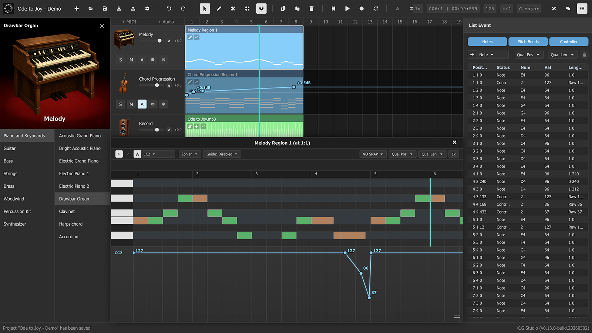
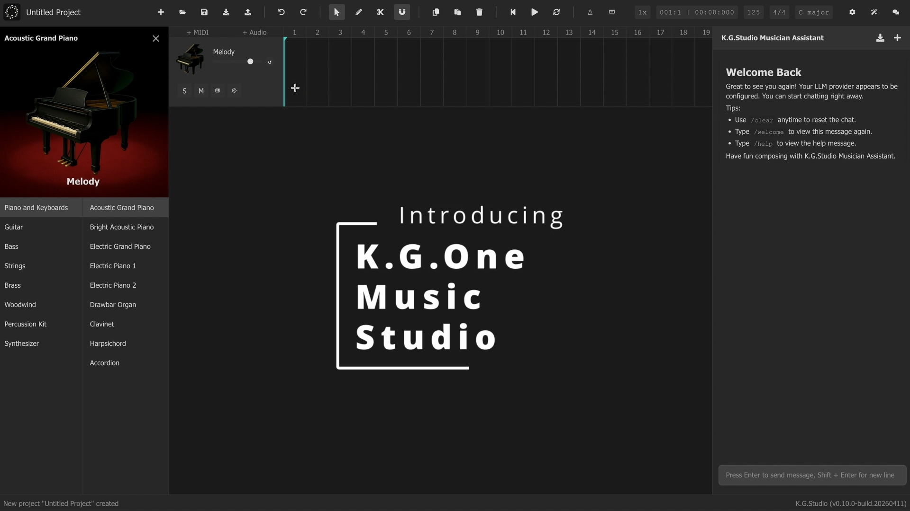

[English](./README.md) | Français | [简体中文](./README-zh_cn.md) | [繁體中文](./README-zh_hk.md)

<div align="center">
  
</div>

# K.G.Studio — Une DAW basée sur le navigateur avec assistant IA

<div align="center">
  <h3><a href="https://kgaudiolab.github.io/kgstudio"><b>◀ Commencer à utiliser K.G.Studio en ligne dans votre navigateur ▶</b></a></h3>
</div>

## Qu'est-ce que K.G.Studio ?

K.G.Studio est une DAW légère et moderne qui fonctionne entièrement dans le navigateur, avec **K.G.Studio Musician Assistant** en son cœur. Il propose une lecture réaliste des instruments via les samplers Tone.js, un éditeur piano roll, une gestion des pistes et des régions avec annulation/rétablissement complets, la persistance des projets dans OPFS (Origin Private File System), un panneau de configuration personnalisable, et un assistant IA intégré avec exécution d'outils.

**K.G.Studio Musician Assistant** est un co-créateur IA conscient du projet, conçu pour enrichir votre flux créatif. Plutôt que de générer directement des fichiers audio bruts, il opère au niveau structuré des pistes et des notes — vous aidant à composer des mélodies, construire des progressions harmoniques et éditer des notes MIDI, tout en vous laissant le contrôle total pour ajuster, affiner et perfectionner chaque détail.

<div align="center">
  
</div>

> Remarque : les fonctions de génération de morceau complet et de génération de clip audio nécessitent l'intégration de [**K.G.One Music Studio**](https://github.com/KGAudioLab/K.G.One).

## Dernières mises à jour

- **2026.06.05** : développement majeur du **K.G.Studio Musician Assistant**, transformé en agent IA de niveau projet complet :
  - **Outils de gestion de pistes** — l'agent peut désormais lister, créer, mettre à jour et supprimer des pistes, et parcourir tous les instruments disponibles, sans nécessiter de sélectionner une région au préalable.
  - **Outils de pistes globales** — accès complet en lecture/écriture/suppression aux quatre pistes globales : **Chord Progression**, **Tempo (BPM)**, **Key Signature** et **Markers**. L'agent peut restructurer l'ensemble du squelette harmonique et rythmique d'un arrangement en une seule conversation.
  - **Confirmation des outils** — les opérations d'écriture affichent une étape de confirmation dans le chat avant d'être exécutées, vous donnant la possibilité de vérifier avant que quoi que ce soit ne change.
  - **Liste de tâches de l'agent** — l'assistant maintient désormais une liste de tâches en ligne, affichée sous forme de cartes de snapshot en direct directement dans le chat, rendant les plans en plusieurs étapes transparents et traçables.
  - **Historique des conversations** — les sessions de chat sont persistées par projet et peuvent être reprises après rechargement de la page.
  - **Compactage automatique du contexte** — les longues conversations sont résumées automatiquement lorsque la limite de contexte approche, permettant aux sessions de continuer sans intervention manuelle.
  - **Mode agent efficace** — un prompt simplifié et un ensemble d'outils réduit pour les modèles de langage plus petits ou locaux, activé automatiquement lors de l'utilisation du Local Browser LLM.

- **2026.05.30** : ajout de la **prise en charge de l'internationalisation (i18n)** — K.G.Studio est désormais disponible en quatre langues : **English**, **Simplified Chinese (简体中文)**, **Traditional Chinese (繁體中文)** et **Français**. La langue active se configure dans **Réglages ⚙️ → Général → Langue**, avec une option `Auto` qui détecte automatiquement la langue de votre navigateur.

- **2026.05.27** :
  - Ajout du **système de pistes globales** : introduction de quatre pistes globales, **Marker**, **Tempo**, **Key Signature** et **Chord** (régions d'étendue avec symboles d'accords).
  - Ajout de la fonction **Audio Chord Detection** : ouvrez la fenêtre piano roll pour une région audio ou MIDI, puis cliquez sur « ... » -> **Detect Chords** pour analyser automatiquement l'enregistrement et remplir la Chord Track à l'aide d'un pipeline FFT sans dépendance, avec sensibilité, stabilité et détection des accords de septième configurables.
  - Ajout de la fonction **Tempo Detection with Auto-Align Beats** : ouvrez la fenêtre piano roll pour une région audio, puis cliquez sur « ... » -> **Detect Tempo** dans la barre d'outils pour analyser le BPM de l'audio et, si vous le souhaitez, réaligner les régions de la Tempo Track du projet.
  - Ajout de **Demucs 4S** comme second modèle local de séparation de stems intégré au navigateur. En plus du modèle UVR-MDX-NET à deux stems existant, le modèle `htdemucs_4s` à quatre stems (~172 MB, vocals / drums / bass / others) est désormais disponible, les deux s'exécutant entièrement dans le navigateur via ONNX Runtime WebGPU.

- **2026.05.15** : ajout de **modèles IA intégrés au navigateur**. Deux modèles IA peuvent désormais fonctionner entièrement dans le navigateur, sans service externe, sans clé API, et sans serveur K.G.One. **K.G.Studio Musician Assistant** gagne un nouveau fournisseur **Local LLM (Browser)** basé sur **Gemma 4 E4B** via LiteRT-LM avec accélération WebGPU ; le modèle est téléchargé une fois puis mis en cache dans OPFS pour des lancements ultérieurs quasi instantanés, avec longueur de contexte configurable (32 k / 64 k / 128 k tokens) et statistiques de performance d'inférence en direct. La **séparation de stems** fonctionne désormais aussi localement grâce à un modèle ONNX **UVR-MDX-NET-Inst_HQ_3** intégré au navigateur avec accélération WebGPU. Ouvrez le panneau **Music Generator** (bouton ✦), téléchargez le modèle une fois, puis séparez voix et accompagnement entièrement sur votre appareil. Les deux fonctions nécessitent un navigateur compatible WebGPU (Chrome 113+ ou Edge 113+) et un contexte sécurisé (HTTPS ou localhost). Matériel recommandé : un GPU avec au moins 8 GB de VRAM ou un système avec au moins 16 GB de mémoire unifiée.

- **2026.05.10** : ajout de la **vue en notation musicale (sheet music)**. Le piano roll propose désormais un mode complet de notation standard. Basculez entre les vues Piano Roll et Sheet Music à l'aide du bouton dans la barre d'outils du piano roll. En mode partition, les notes sont gravées via VexFlow avec sélection automatique de la clé (sol ou fa) selon l'instrument actif, affichage de l'armure, groupement automatique des crochets, liaisons entre mesures et quantification configurable pour la résolution des valeurs de notes. Activez **Track Scope** pour afficher toutes les régions MIDI de la piste comme une partition continue plutôt qu'une seule région isolée.

- **2026.05.09** : ajout de **l'enregistrement audio**. Vous pouvez désormais enregistrer directement depuis votre microphone dans une piste audio. Un aperçu de forme d'onde en direct se développe en temps réel pendant l'enregistrement, et la région est ajoutée à la timeline comme région audio standard à l'arrêt. Ajout également de la **sélection des périphériques audio I/O** dans les paramètres afin de choisir votre entrée micro et votre sortie audio préférées.

- **2026.05.08** : ajout de **l'automation MIDI**. Vous pouvez dessiner et modifier des courbes de pitch bend et de MIDI CC (CC1 Modulation, CC2 Breath, CC7 Volume, CC11 Expression, CC64 Sustain) dans une lane d'automation éditable sous la grille piano. Ajout de **l'automation au niveau de la piste** : chaque piste dispose désormais d'un panneau d'automation dédié où vous pouvez voir et modifier les mêmes courbes directement sur la timeline. Les entrées de contrôleurs MIDI en temps réel (pitch wheel, pédales CC) sont enregistrées et relues avec interpolation par lane. Ajout du **panneau Event List** : une barre latérale à onglets (Notes / Pitch Bend / Controller) pour inspecter et modifier en ligne tous les événements de la région MIDI active. Ajout également de la **sélection multiple de régions** avec lasso et déplacement/redimensionnement de groupe, ainsi que de la **fusion de régions MIDI**.
<div align="center">
  
</div>

- **2026.05.02** : ajout de la **visualisation spectrogramme des pistes audio**. Les régions audio affichent désormais une superposition de spectrogramme en temps réel dans la grille des pistes. Ajout du **Piano Roll hybrid mode** : ouvrez le piano roll sur une région MIDI pendant que le spectrogramme d'une région audio voisine est affiché comme couche de référence, afin d'éditer les notes MIDI en fonction de la forme visuelle de l'audio. Ajout du **zoom avant/arrière dans le piano roll** avec conservation de la position de la vue pour qu'elle reste ancrée près de la tête de lecture actuelle. Ajout également du **réglage fin de la position des régions** avec petits incréments pour un placement précis. Enfin, ajout de la synchronisation du défilement de la tête de lecture entre composants afin que la grille principale et le piano roll restent synchronisés pendant la lecture.

Pour consulter l'historique complet des versions, voir les [**Notes de version**](./docs/RELEASE_NOTES.md).

## État du projet

**K.G.Studio est un projet expérimental encore en phase de développement précoce.** Nous explorons les possibilités d'intégrer des agents IA et des LLM dans les flux de production musicale, en construisant essentiellement une expérience de type « Cursor ou Claude Code pour DAW ».

Ce projet étudie comment la collaboration entre l'IA et l'humain peut enrichir la création musicale, depuis les suggestions harmoniques intelligentes jusqu'aux tâches d'édition automatisées. En tant que plateforme expérimentale, attendez-vous à des changements fréquents, des fonctionnalités en évolution et une instabilité occasionnelle au fur et à mesure que nous repoussons les limites de la production musicale assistée par l'IA.

## Vidéos de démonstration

<div align="center">
  <table>
    <tr>
      <td align="center">
        <a href="https://youtu.be/F1JWjK84zwc" target="_blank">
          
        </a>
        <br><b>K.G.One Music Studio</b>
      </td>
      <td align="center">
        <a href="https://youtu.be/FXgihfAH2vc" target="_blank">
          
        </a>
        <br><b>Démo courte (DAW uniquement)</b>
      </td>
      <td align="center">
        <a href="https://youtu.be/vKbWAQRt0r0" target="_blank">
          
        </a>
        <br><b>Démo complète (DAW uniquement)</b>
      </td>
    </tr>
  </table>
</div>

## Démarrage rapide

### Configurer K.G.Studio Musician Assistant

Il existe deux façons d'utiliser K.G.Studio Musician Assistant : **Local LLM (Browser)**, qui s'exécute entièrement dans votre navigateur sans clé API, sans coût et sans que les données quittent votre appareil, ou un **fournisseur LLM externe** pour obtenir des réponses de meilleure qualité.

#### Option A : Local LLM (Browser) — Aucune clé API requise ✦

K.G.Studio peut exécuter **Gemma 4 E4B** directement dans votre navigateur grâce à l'accélération WebGPU. Aucun appel API n'est effectué, aucun coût n'est engagé et vos données ne quittent jamais votre machine.

  - Cliquez ici pour commencer à utiliser l'application en ligne : [K.G.Studio (kgaudiolab.github.io/kgstudio)](https://kgaudiolab.github.io/kgstudio)
  - Dans **Settings ⚙️ → General → LLM Provider**, sélectionnez **Local LLM (Browser)** (option par défaut).
  - Le modèle (~2.8 GB) se télécharge automatiquement la première fois que vous ouvrez le chat et est mis en cache dans l'OPFS (Origin Private File System) de votre navigateur pour des lancements ultérieurs quasi instantanés.
  - Vous pouvez également configurer la **Context Length** (32k / 64k / 128k tokens) ; des valeurs plus élevées nécessitent davantage de VRAM.
  - Commencez à discuter ! Pas de clé, pas de compte, pas de trafic réseau après le téléchargement initial du modèle.

**Conditions pour Local LLM :** un navigateur compatible WebGPU (Chrome 113+ ou Edge 113+) exécuté dans un contexte sécurisé (HTTPS ou localhost). Matériel recommandé : un GPU avec au moins 8 GB de VRAM, ou un système avec au moins 16 GB de mémoire unifiée.

> **Remarque :** la qualité du modèle local ne peut pas être comparée à celle des modèles commerciaux de type GPT ou Claude. Pour des tâches d'édition musicale complexes, un fournisseur externe produira en général de meilleurs résultats.

#### Option B : Fournisseur LLM externe (meilleure qualité)

  - Cliquez ici pour commencer à utiliser l'application en ligne : [K.G.Studio (kgaudiolab.github.io/kgstudio)](https://kgaudiolab.github.io/kgstudio)
  - [Cliquez ici pour obtenir une clé API OpenRouter gratuite](https://openrouter.ai/keys) (vous pouvez avoir besoin d'un compte OpenRouter).
  - Dans **Settings ⚙️ → General → LLM Provider**, sélectionnez **OpenAI Compatible**.
  - Dans **OpenAI Compatible Server → Key**, collez votre clé. (Remarque : hors localhost, votre clé n'est pas persistée par défaut pour des raisons de sécurité ; vous pouvez activer « Persist API Keys on Non-Localhost » dans les paramètres pour la persister, mais cela peut augmenter le risque XSS.)
  - Dans **OpenAI Compatible Server → Model**, saisissez `openai/gpt-oss-120b:free`. (Remarque : il s'agit d'un modèle gratuit ; les modèles non gratuits peuvent nécessiter une facturation ; les fournisseurs de modèles gratuits peuvent collecter vos données, consultez la page du modèle pour plus de détails ; ce projet **n'est pas** affilié à OpenRouter ni à aucun fournisseur de modèles.)
  - Dans **OpenAI Compatible Server → Base URL**, saisissez `https://openrouter.ai/api/v1`.

**Conseils :**
- Vous pouvez également utiliser l'API officielle d'OpenAI, d'autres services compatibles OpenAI, ou un serveur LLM auto-hébergé (par exemple Ollama, vLLM). Notez que la qualité des modèles varie : tous les modèles ne sont pas aussi performants pour les tâches d'édition musicale. Pour l'auto-déploiement (nécessite ~24 Go de VRAM ou 24-32 Go de mémoire unifiée), nous recommandons : `qwen/qwen3.6-35b-a3b`, `google/gemma-4-26b-a4b-it` ou `google/gemma-4-31b-it`.
- Si vous disposez d'un abonnement actif chez OpenAI ou chez un autre fournisseur LLM, vous pouvez utiliser [CLIProxyAPI](https://github.com/router-for-me/CLIProxyAPI) pour exécuter un serveur proxy local qui achemine les requêtes via votre abonnement existant, sans nécessiter de clé API séparée.

### Opérations DAW de base
  - Double-cliquez (ou maintenez Ctrl/Cmd et cliquez) sur une piste pour créer une région.
  - Faites glisser les bords de la région pour la redimensionner ; faites glisser son corps pour la déplacer.
  - Cliquez sur le petit crayon en haut à gauche d'une région pour ouvrir le piano roll.
  - Dans le piano roll, double-cliquez (ou Ctrl/Cmd+clic) pour créer une note.
  - Cliquez pour sélectionner ; Shift+clic pour la multi-sélection ; glissez pour faire une sélection rectangulaire.
  - Faites glisser les bords de la note pour la redimensionner ; faites glisser le corps de la note pour déplacer les notes sélectionnées.
  - Utilisez Snapping dans la barre d'outils du piano roll (en haut à droite) pour quantifier sur la grille.

### Utiliser K.G.Studio Musician Assistant
  - Sélectionnez la région musicale sur laquelle vous souhaitez que l'assistant travaille, saisissez votre prompt dans le chat ; appuyez sur Enter pour envoyer, Shift+Enter pour insérer une nouvelle ligne.
  - L'agent traitera automatiquement votre demande et invoquera des outils pour effectuer des modifications limitées à la région sélectionnée. Une tâche peut nécessiter un ou plusieurs tours pour être accomplie.
  - Notez que l'IA peut se tromper ; vous devez donc toujours vérifier le résultat et l'ajuster si nécessaire. Vous pouvez également utiliser annulation/rétablissement pour revenir sur les changements.
  - Cliquez sur le bouton « + » ou utilisez la commande `/clear` pour effacer l'historique du chat.

### Plus de détails

Vous trouverez le guide utilisateur détaillé [ici](./docs/USER_GUIDE.md).

### Points forts
- **K.G.Studio Musician Assistant** : discutez avec l'agent IA alimenté par un LLM ; il exécute automatiquement des outils pour effectuer des modifications musicales dans la région sélectionnée.
- **LLM intégré au navigateur — aucune clé API requise** : exécutez **Gemma 4 E4B** entièrement dans votre navigateur via WebGPU (LiteRT-LM). Aucun appel API, aucun coût, aucune donnée quittant votre appareil. Le modèle est téléchargé une fois et mis en cache localement.
- **Séparation de stems intégrée au navigateur — aucun serveur requis** : séparez n'importe quelle région audio en stems avec **UVR-MDX-NET-Inst_HQ_3** (2 stems : Vocals / Instrumental) ou **Demucs htdemucs_4s** (4 stems : Vocals / Drums / Bass / Others), tous deux entièrement exécutés dans le navigateur via ONNX Runtime WebGPU, sans serveur K.G.One.
- **Détection d'accords audio** : ouvrez le piano roll sur une région audio et lancez **Detect Chords** pour analyser automatiquement l'enregistrement et remplir la Chord Track globale avec un pipeline FFT sans dépendance, avec sensibilité, stabilité et détection des accords de septième configurables.
- **Détection de tempo avec alignement automatique des temps** : lancez **Detect Tempo** depuis la barre d'outils du piano roll pour analyser le BPM d'une région audio et, si vous le souhaitez, réaligner la Tempo Track du projet.
- **Système de pistes globales** : quatre pistes globales persistantes — **Marker**, **Tempo**, **Key Signature** et **Chord** — fournissent une structure à l'échelle du projet à laquelle toutes les fonctions (timing de lecture, détection d'accords, notation musicale) se réfèrent.
- **Intégration K.G.One Music Studio** : lorsqu'il est connecté à un serveur local [K.G.One](https://github.com/KGAudioLab/K.G.One), vous débloquez la **Full Song Generation** accélérée par GPU (ACE-Step 1.5), la **Clip & MIDI Loop Generation** (Foundation-1) et des modèles supplémentaires de **Stem Separation**.
- **Plusieurs fournisseurs LLM** : OpenAI, Claude / Gemini (via OpenRouter), services compatibles OpenAI (Ollama, vLLM, etc.), ou Local Browser LLM intégré — sans clé requise.
- **Édition de pistes et de régions** : ajouter/réordonner des pistes, créer/déplacer/redimensionner des régions, multi-sélection avec lasso, déplacement/redimensionnement de groupe, fusion et scission de régions, avec annulation/rétablissement complet.
- **Piano roll** : notes, pitch bend et lanes d'automation MIDI CC ; vue de notation musicale (sheet music) via VexFlow ; superposition de spectrogramme pour la référence audio-vers-MIDI.
- **Vrais instruments** : sampler basé sur Tone.js avec soundfonts FluidR3 de haute qualité. Enregistrez directement l'audio depuis votre microphone vers une piste audio.
- **Assistant d'accords intelligent** : suggestions d'accords en temps réel basées sur l'harmonie fonctionnelle (T/S/D), avec aperçu visuel et création d'accord en un clic.
- **Persistance avec confidentialité** : projets et configuration enregistrés entièrement dans votre navigateur (OPFS / IndexedDB). Aucun serveur propriétaire.

Pour une vue technique plus approfondie, voir [overview.md](./docs/technical/overview.md).

## Premiers pas

### Ou cloner et exécuter localement :
```bash
# Assurez-vous d'avoir Node.js >= 20.19.3 installé
# Cloner le dépôt
git clone https://github.com/KGAudioLab/KGStudio {your-local-path}
cd {your-local-path}

# Installer les dépendances
npm install

# Lancer le serveur de développement
npm run dev
```

## Configuration

K.G.Studio charge ses valeurs par défaut depuis `./public/config.json` (avec une valeur de secours interne) et persiste les modifications utilisateur dans le navigateur via `ConfigManager` + IndexedDB. IndexedDB est la base de données locale propre à votre navigateur, stockée sur votre appareil ; elle ne quitte pas votre machine et est effacée si vous supprimez les données de ce site. Modifiez les paramètres via le panneau Settings intégré à l'application.

- **General**
  - Fournisseur LLM : OpenAI, ou compatible OpenAI
  - Clés API et modèles pour le fournisseur sélectionné
  - Persist API Keys on Non-Localhost : permet de persister les clés API dans des environnements non localhost (option de sécurité volontaire, non recommandée pour les environnements partagés ou de production)
  - Base URL compatible OpenAI (pour les passerelles auto-hébergées)
  - Base URL des soundfonts (CDN pour les échantillons d'instruments)
- **Behavior**
  - Ouverture du chat par défaut au démarrage
- **Templates**
  - Instructions personnalisées utilisées par l'assistant IA

### Connectivité et confidentialité

- K.G.Studio fonctionne entièrement côté client. Aucun serveur propriétaire n'est nécessaire pour faire fonctionner l'application.
- Les projets et fichiers audio sont stockés dans l'OPFS (Origin Private File System) de votre navigateur ; la configuration est stockée dans IndexedDB. Toutes les données restent sur votre appareil.
- L'accès réseau est utilisé uniquement pour :
  - télécharger les échantillons d'instruments depuis le CDN de soundfonts configuré
  - communiquer avec le fournisseur LLM que vous avez choisi (par exemple OpenAI ou des services compatibles OpenAI)
- En dehors de ces deux cas, l'application fonctionne localement. Si vous bloquez ces points d'accès, l'application se charge toujours ; la lecture des instruments et les fonctions IA ne fonctionneront pas tant que l'accès réseau ne sera pas rétabli.
- Pour des raisons de sécurité, lorsque l'application est exécutée depuis un hôte non local, nous ne persistons pas votre clé API dans IndexedDB par défaut (afin de réduire le risque XSS). Vous devrez la saisir à chaque démarrage de K.G.Studio. Pour activer la persistance sur des hôtes non locaux, activez « Persist API Keys on Non-Localhost » dans les paramètres (non recommandé pour les environnements partagés ou de production).

## Utiliser l'application

Vous trouverez le guide utilisateur détaillé [ici](./docs/USER_GUIDE.md).

- Pistes
  - Ajoutez, renommez et réordonnez les pistes depuis le panneau d'informations des pistes.
  - Changez d'instrument avec le bouton d'instrument (icône de piano) ; ajustez Solo (S), Mute (M) et Volume.
  - Supprimez une piste depuis le menu des paramètres de la piste (bouton à droite de l'instrument).

- Régions
  - Créer une région : avec l'outil Pointer, double-cliquez ; ou maintenez Ctrl/Cmd et cliquez. Avec l'outil Pencil, cliquez une seule fois.
  - Déplacer/redimensionner : faites glisser le corps pour déplacer ; faites glisser les bords pour redimensionner.
  - Ouvrez le Piano Roll via le petit crayon en haut à gauche d'une région.

- Piano Roll (notes MIDI)
  - Outils : Select vs Pencil.
  - Créer des notes : double-cliquez ou Ctrl/Cmd+clic (Select) ; clic simple (Pencil).
  - Sélectionner des notes : clic ; Shift+clic pour la multi-sélection ; glisser pour la sélection rectangulaire.
  - Déplacer/redimensionner : faites glisser le corps de la note pour déplacer les notes sélectionnées ; faites glisser les bords pour redimensionner.
  - **Vue en notation musicale** : basculez entre les vues Piano Roll et Staff Notation depuis la barre d'outils du piano roll. Prend en charge la sélection automatique de la clé, l'affichage de l'armure, le groupement des crochets, les liaisons et la quantification configurable. Activez **Track Scope** pour afficher toutes les régions de la piste comme une partition continue.
  - **Lanes d'automation** : dessinez et modifiez des courbes de pitch bend et de MIDI CC (Modulation, Breath, Volume, Expression, Sustain) dans la lane éditable sous la grille piano.
  - **Mode spectrogramme** : affichez le spectrogramme d'une région audio dans le piano roll comme couche de référence pendant l'édition des notes MIDI.
  - Fermez le piano roll avec X ou ESC.

- Intelligent Chord Assistant (ajouté le 2025-12-15)
  - Activez le guide d'accords depuis la barre d'outils du piano roll : sélectionnez la fonction T (Tonic), S (Subdominant) ou D (Dominant).
  - Survolez n'importe quelle touche pour voir les suggestions d'accords adaptées au contexte, mises en évidence en rouge, en accord avec l'armure et le mode sélectionnés.
  - Appuyez sur Tab pour faire défiler différents renversements d'accords pour la même fonction harmonique.
  - Double-cliquez (ou Ctrl/Cmd+clic) sur un accord surligné pour créer toutes les notes d'un coup.
  - La longueur de l'accord correspond automatiquement à la dernière longueur de note modifiée pour conserver un rythme cohérent.

- Snapping et quantification
  - Définissez le snapping depuis le menu NO SNAP (en haut à droite).
  - Quantifiez le timing avec Qua. Pos. (début) et Qua. Len. (longueur).

- Lecture et tête de lecture
  - Retour au début ; lecture/pause depuis la barre d'outils.
  - Placez la tête de lecture en cliquant sur les numéros de mesure dans la grille principale ; dans Piano Roll, cliquez sur l'en-tête de la timeline (respecte le snapping).
  - Modifiez le BPM, la signature rythmique et la tonalité via les indicateurs de la barre d'outils.

## Raccourcis clavier

- Principal
  - Lecture/Pause : Space
  - Annuler / Rétablir : Ctrl/Cmd+Z / Ctrl/Cmd+Shift+Z
  - Copier / Couper / Coller : Ctrl/Cmd+C / Ctrl/Cmd+X / Ctrl/Cmd+V
  - Sauvegarder : Ctrl/Cmd+S
  - Maintenir pour créer une région : Ctrl/Cmd
- Piano Roll
  - Outils : Select (Q), Pencil (W)
  - Maintenir pour créer une note : Ctrl/Cmd
  - Snap : 1(None), 2(1/4), 3(1/8), 4(1/16)
  - Quantification de position : 5(1/4), 6(1/8), 7(1/16)
  - Quantification de longueur : 8(1/4), 9(1/8), 0(1/16)

## Assistant IA

### Utiliser K.G.Studio Musician Assistant

- Assurez-vous d'avoir suivi la section précédente pour configurer le fournisseur LLM.
- Vous trouverez la zone de chat de K.G.Studio Musician Assistant à droite. Si vous ne la voyez pas, cliquez sur le bouton Chat 🗨️ dans la barre d'outils.
- Sélectionnez la région sur laquelle vous souhaitez que l'assistant travaille, saisissez votre prompt dans le chat ; appuyez sur Enter pour envoyer, Shift+Enter pour insérer une nouvelle ligne.
- L'agent traitera automatiquement votre demande et invoquera des outils pour effectuer des modifications limitées à la région sélectionnée. Une tâche peut nécessiter un ou plusieurs tours pour être accomplie.
- Notez que l'IA peut se tromper ; vous devez donc toujours vérifier le résultat et l'ajuster si nécessaire. Vous pouvez aussi utiliser annulation/rétablissement pour revenir en arrière.
- Cliquez sur le bouton « + » ou sur la commande `/clear` pour effacer l'historique du chat.

### Configurer votre fournisseur LLM

Allez dans **Settings ⚙️ → General → LLM Provider**. Selon le fournisseur choisi, vous devrez fournir la clé API appropriée et, le cas échéant, une base URL personnalisée (pour les services non officiels compatibles OpenAI comme Ollama, OpenRouter, etc.).

Remarque : en raison des limitations CORS chez certains fournisseurs, Google Gemini et Anthropic Claude ne sont actuellement pris en charge que via OpenRouter.

### Utiliser les modèles OpenAI

1. Obtenez une clé API OpenAI auprès de [**OpenAI**](https://platform.openai.com/account/api-keys). Vous devrez peut-être créer un compte et ajouter un moyen de paiement pour générer une clé API.
2. Dans **Settings ⚙️ → General → LLM Provider**, sélectionnez **OpenAI** comme fournisseur.
3. Saisissez votre clé API dans **OpenAI → Key**.
4. Sélectionnez votre modèle préféré dans la liste **OpenAI → Model**. Pour un bon équilibre entre performances et coût, nous recommandons `gpt-5.4`.
5. Vous pouvez également choisir d'activer Flex Mode dans **OpenAI → Flex Mode**. Flex Mode offre un tarif réduit, mais peut entraîner des temps de réponse plus lents ou des erreurs côté serveur.

### Utiliser OpenRouter

OpenRouter est une plateforme qui fournit un accès unifié à un large éventail de modèles de langage, y compris des options gratuites, provenant de divers fournisseurs. Cela facilite l'expérimentation et la recherche du modèle le mieux adapté à vos besoins.

1. Obtenez une clé API auprès de [**OpenRouter**](https://openrouter.ai/keys). L'inscription est requise ; pour les modèles payants, un moyen de paiement peut également être nécessaire.
2. Dans **Settings ⚙️ → General → LLM Provider**, sélectionnez **OpenAI Compatible** comme fournisseur.
3. Saisissez votre clé API dans **OpenAI Compatible Server → Key**.
4. Parcourez les modèles disponibles sur la [**page des modèles OpenRouter**](https://openrouter.ai/models). Utilisez le filtre « Prompt Pricing » pour identifier les modèles gratuits.  
   **Remarque :** chaque fournisseur de modèle peut avoir des politiques différentes en matière de conservation des données et de confidentialité. Veuillez les consulter avant utilisation.
5. Saisissez le nom du modèle choisi dans **OpenAI Compatible Server → Model**. Les séries recommandées comprennent :
    - `Anthropic: Claude Sonnet 4.6` (`anthropic/claude-sonnet-4.6`: [Link](https://openrouter.ai/anthropic/claude-sonnet-4.6)) — meilleur équilibre qualité/coût pour la série Claude
    - Modèles gratuits :
        - `OpenAI: GPT-OSS 120B` (MODÈLE GRATUIT : `openai/gpt-oss-120b:free`: [Link](https://openrouter.ai/openai/gpt-oss-120b:free))
        - `Google: Gemma 4 26B A4B IT` (MODÈLE GRATUIT : `google/gemma-4-26b-a4b-it:free`: [Link](https://openrouter.ai/google/gemma-4-26b-a4b-it:free))
        - `Google: Gemma 4 31B IT` (MODÈLE GRATUIT : `google/gemma-4-31b-it:free`: [Link](https://openrouter.ai/google/gemma-4-31b-it:free))
    - Pour l'auto-déploiement (nécessite ~24 Go de VRAM ou 24-32 Go de mémoire unifiée), nous recommandons :
        - `Qwen: Qwen3.6 35B A3B` (`qwen/qwen3.6-35b-a3b`: [Link](https://openrouter.ai/qwen/qwen3.6-35b-a3b))
        - `Google: Gemma 4 26B A4B IT` (`google/gemma-4-26b-a4b-it`: [Link](https://openrouter.ai/google/gemma-4-26b-a4b-it))
        - `Google: Gemma 4 31B IT` (`google/gemma-4-31b-it`: [Link](https://openrouter.ai/google/gemma-4-31b-it))
    - Remarque : les fournisseurs de modèles gratuits peuvent collecter vos données ; consultez la page du modèle avant utilisation
    - Remarque : la disponibilité des modèles gratuits change fréquemment ; pour les options gratuites les plus récentes, consultez la [page des modèles OpenRouter](https://openrouter.ai/models) et utilisez le filtre **Prompt Pricing**
6. Saisissez l'URL de base `https://openrouter.ai/api/v1` dans **OpenAI Compatible Server → Base URL**.

### À propos de l'agent et des fournisseurs LLM

Pour des raisons de sécurité, lorsque vous utilisez K.G.Studio depuis un hôte non local, les clés API ne sont pas persistées dans IndexedDB par défaut ; vous devrez donc saisir votre clé API à chaque démarrage de K.G.Studio. Pour activer la persistance sur des hôtes non locaux, activez « Persist API Keys on Non-Localhost » dans les paramètres (non recommandé pour les environnements partagés ou de production).

K.G.Studio ne fournit ni n'héberge aucun des modèles listés ci-dessus et n'est affilié à aucun fournisseur de modèles. Toutes les données sont stockées localement sur votre appareil ; K.G.Studio ne collecte ni ne transmet vos données. Vous êtes seul responsable de toute donnée que vous fournissez à des fournisseurs de modèles tiers.

## K.G.One Music Generator

> **Nécessite l'intégration de [K.G.One Music Studio](https://github.com/KGAudioLab/K.G.One).** Le panneau K.G.One Music Generator n'est disponible que lorsque K.G.Studio est connecté à un serveur K.G.One en fonctionnement. Consultez le [dépôt K.G.One](https://github.com/KGAudioLab/K.G.One) pour les instructions d'installation.

Le panneau **K.G.One Music Generator** fournit trois outils IA accélérés par GPU pour la génération musicale et le traitement audio. Cliquez sur le bouton **✦ (baguette magique)** dans la barre d'outils pour l'ouvrir. Le panneau est mutuellement exclusif avec la zone de chat AI Assistant : l'ouverture de l'un ferme l'autre.

> **Remarque :** la première fois que vous utilisez chaque outil, le serveur doit charger le modèle IA correspondant, ce qui peut prendre 60 secondes ou plus selon votre matériel. Changer d'onglet peut également déclencher un rechargement du modèle.

### Full Song Generation

Générez une chanson complète de longue durée à partir d'une description textuelle et de paroles facultatives. Alimenté par [ACE-Step 1.5](https://github.com/ace-step/ACE-Step-1.5).

- Dans l'onglet **Full Song**, saisissez un **Caption** décrivant le style, l'ambiance, le tempo, l'instrumentation et la structure souhaités en langage naturel. Exemple : `Genre: Eurodance, 90s dance-pop, upbeat electronic. Tempo: ~130 BPM. Instrumentation: driving kick drum, eurodance bassline...`
- Vous pouvez éventuellement saisir des **Lyrics**. Utilisez les balises `[Intro]`, `[Verse]`, `[Chorus]`, `[Bridge]` pour marquer les sections. Cochez **Instrumental** pour ne pas générer de voix.
- Cliquez sur **Generate Song**. Un indicateur de progression affiche en temps réel l'étape de génération et le pourcentage.
- Une fois la génération terminée, un lecteur de prévisualisation apparaît. Faites-le glisser sur une **audio track** pour importer le morceau comme région.
- Le glisser-déposer sur une piste MIDI n'est pas pris en charge pour la génération de morceau complet.
- **Advanced Settings** (dépliable) : Inference Steps, Guidance Scale, Seed, et Thinking (CoT metadata generation).

### Clip Generation

Générez de courts clips instrumentaux et des boucles MIDI à partir de descriptions textuelles. Alimenté par [Foundation-1](https://huggingface.co/RoyalCities/Foundation-1).

- Dans l'onglet **Clip**, saisissez un **Prompt** décrivant le clip à l'aide de tags séparés par des virgules couvrant la famille d'instruments, le sous-type, le timbre, les effets, la longueur, le BPM et la tonalité. Exemple : `Gritty, Acid, Bassline, 303, Synth Lead, FM, Sub, High Reverb, 8 Bars, 140 BPM, E minor`
- Vous pouvez éventuellement saisir un **Negative Prompt** pour éloigner la génération de caractéristiques non désirées (par ex. `distortion, noise`).
- Sélectionnez **Bars** : 4 ou 8. Le BPM et la tonalité sont préremplis à partir des paramètres de votre projet et peuvent être ajustés dans **Advanced Settings**.
- Cliquez sur **Generate Clip**. Une fois terminé, un lecteur de prévisualisation apparaît avec une poignée de glisser à gauche et un bouton de téléchargement à droite.
- **Pour importer** : faites glisser le lecteur sur une piste de la timeline.
  - Déposez-le sur une **audio track** pour l'importer comme région audio WAV (recommandé).
  - Déposez-le sur une **MIDI track** pour l'importer comme région MIDI. Notez que le MIDI est transcrit depuis l'audio et peut ne pas être parfaitement exact.
- **Advanced Settings** (dépliable) : Note, Scale, BPM, Steps, CFG Scale, Seed (`-1` pour aléatoire), Sampler Type, Sigma Min/Max, et CFG Rescale.

### Stem Separation

Séparez une région audio existante en stems individuels (par exemple voix, instruments, batterie).

K.G.Studio prend en charge **deux modes** de séparation de stems :

#### Mode navigateur local — Aucun serveur requis ✦

Deux modèles ONNX s'exécutent entièrement dans votre navigateur, sans appels API, sans coût, et sans que vos données quittent votre appareil. Les modèles sont téléchargés une fois puis mis en cache localement.

- **Vocal and Instrument (Medium Accuracy)** (`UVR-MDX-NET-Inst_HQ_3`, ~64 MB) — séparation en deux stems (Vocals / Instrumental). Alimenté par [UVR-MDX-NET](https://github.com/nomadkaraoke/python-audio-separator).
- **Vocal, Drums, Bass, and Others** (`htdemucs_4s`, ~172 MB) — séparation en quatre stems (Vocals / Drums / Bass / Others). Alimenté par [Demucs](https://github.com/facebookresearch/demucs).

Ouvrez le panneau **Music Generator** (bouton ✦ dans la barre d'outils), sélectionnez un modèle, cliquez une fois sur **Download Selected Model**, puis sur **Separate Stems** : tout s'exécute localement dans votre navigateur.

**Conditions requises :** un navigateur compatible WebGPU (Chrome 113+ ou Edge 113+) dans un contexte sécurisé (HTTPS ou localhost). L'accélération WebGPU est utilisée lorsque disponible ; sinon, le système revient au CPU (ce qui peut réduire la réactivité de la page pendant le traitement). Matériel recommandé : un GPU avec au moins 8 GB de VRAM, ou un système avec au moins 16 GB de mémoire unifiée.

#### Mode serveur K.G.One

Lorsqu'il est connecté à un serveur [K.G.One Music Studio](https://github.com/KGAudioLab/K.G.One), trois modèles supplémentaires accélérés par GPU sont disponibles. Alimenté par [python-audio-separator (UVR5)](https://github.com/nomadkaraoke/python-audio-separator).

- **Vocal and Instrument (Medium Accuracy)** (`UVR-MDX-NET-Inst_HQ_3`) — séparation rapide en deux stems (vocal / instrumental).
- **Vocal and Instrument (High Accuracy)** (`MDX23C-8KFFT-InstVoc_HQ`) — séparation en deux stems de meilleure qualité, plus lente.
- **Vocal, Drums, Bass, Guitar, Piano, and Others** (`htdemucs_6s`) — séparation complète en six stems.

#### Utilisation (dans les deux modes)

- **Sélectionnez une région audio** sur la timeline avant d'ouvrir cet onglet. La région sélectionnée et le nom de sa piste sont affichés en haut de l'onglet **Separator**. Seules les régions audio sont prises en charge ; les régions MIDI ne peuvent pas être séparées.
- Cliquez sur **Separate Stems**. Si la région sélectionnée a un clip start offset ou a été découpée, l'audio est automatiquement tronqué pour correspondre à la plage de la région avant traitement.
- Une fois terminé, chaque stem apparaît comme lecteur de prévisualisation étiqueté avec une poignée de glisser. Vous pouvez prévisualiser chaque stem individuellement avant l'import.
- **Pour importer les stems :**
  - Faites glisser chaque lecteur de stem individuellement sur une **audio track** pour le placer où vous le souhaitez.
  - Ou cliquez sur **Import All Stems to Timeline** pour créer automatiquement une nouvelle piste audio par stem, positionnée juste sous la piste source et alignée sur le même point de départ que la région d'origine. Il s'agit d'une seule opération annulable.

## Fonctionnalités à venir

Les priorités peuvent évoluer.

### 1.0

- [X] Plus d'instruments
- [X] Tests automatisés (tests unitaires, tests d'intégration, etc.)
- [X] Assistant d'accords intelligent avec guidage harmonique fonctionnel (T/S/D)
- [X] Prise en charge des automations de contrôle de piste (par ex. sustain, volume, pan, etc.)
- [X] Prise en charge des événements de contrôle MIDI (par ex. CC, pitch bend, etc.)
- [X] Prise en charge des pistes audio WAV
- [X] Enregistrement
- [X] Event List
- [X] Ajout de la prise en charge des modèles open source d'OpenAI (`gpt-oss-20b` et `gpt-oss-120b`)
- [X] Notation musicale
- [X] Intégration K.G.One Music Studio
- [X] Modèles IA intégrés au navigateur (LLM sur l'appareil via Gemma 4 E4B ; séparation de stems sur l'appareil via UVR-MDX-NET-Inst_HQ_3 et htdemucs_4s)
- [X] Système de pistes globales (Marker, Tempo, Key Signature, Chord)
- [X] Détection d'accords audio (FFT sans dépendance, remplit la Chord Track)
- [X] Détection de tempo avec alignement automatique des temps
- [X] Visualisation spectrogramme et Piano Roll hybrid mode

### Après la 1.0

- [X] Extension des outils de l'agent IA pour manipuler directement depuis le chat les régions, les pistes et les pistes globales (progressions d'accords, tempo, tonalité)
- [ ] Vue Mixer avec panneau dédié, faders par piste, sends, bus de retour et canal master
- [ ] EQ et channel strip avec égaliseur paramétrique et compresseur par piste
- [ ] Filtres et effets, comme réverbération, délai et autres effets d'insertion natifs WebAudio
- [ ] Audio time-stretch / warp pour étirer les régions audio et les adapter au tempo du projet
- [ ] Effets MIDI, comme arpégiateur, quantificateur de gamme et mémoire d'accords
- [ ] Sortie vers périphérique MIDI virtuel

## Aide recherchée

Nous cherchons des contributeurs pour rendre K.G.Studio encore meilleur ! Que vous soyez développeur, musicien ou designer, votre expertise peut faire une réelle différence.

### Comment vous pouvez aider

**🎵 Musiciens & producteurs**
- Tester la DAW avec de vrais workflows de production musicale
- Donner des retours sur la qualité et le réalisme des instruments
- Suggérer des fonctionnalités manquantes essentielles à la création musicale
- Aider à améliorer la compréhension musicale de l'assistant IA

**💻 Développeurs**
- Implémenter de nouvelles fonctionnalités de notre feuille de route
- Corriger des bugs et améliorer les performances
- Renforcer l'intégration Web Audio
- Travailler sur les capacités de l'assistant IA

**🎨 Designers UI/UX**
- Améliorer l'interface utilisateur et le workflow
- Concevoir un meilleur retour visuel pour l'édition musicale
- Créer des interactions plus intuitives

### Participer

Intéressé par une contribution ? Nous serions ravis d'avoir de vos nouvelles !

- **Écrivez-nous** : [kgstudio@duck.com](mailto:kgstudio@duck.com)
- **Consultez nos Issues** : parcourez les tickets ouverts avec les labels `help wanted` ou `good first issue`
- **Rejoignez les Discussions** : partagez vos idées et retours dans GitHub Discussions

Aucune contribution n'est trop petite : du signalement de bugs à la proposition de nouvelles fonctionnalités, chaque aide fait avancer le projet.

### Avertissement

K.G.Studio est un projet expérimental en phase de développement précoce. Nous explorons les possibilités d'intégrer des agents IA et des LLM dans les flux de production musicale, en construisant essentiellement une expérience de type « Cursor ou Claude Code pour DAW ».

Ce projet étudie comment la collaboration entre l'IA et l'humain peut enrichir la création musicale, depuis les suggestions harmoniques intelligentes jusqu'aux tâches d'édition automatisées. En tant que plateforme expérimentale, attendez-vous à des changements fréquents, des fonctionnalités en évolution et une instabilité occasionnelle à mesure que nous repoussons les limites de la production musicale assistée par l'IA.

K.G.Studio ne fournit ni n'héberge aucun modèle LLM et n'est affilié à aucun fournisseur de modèles. Toutes les données sont stockées localement sur votre appareil ; K.G.Studio ne collecte ni ne transmet vos données. Vous êtes seul responsable de toute donnée que vous fournissez à des fournisseurs de modèles tiers.

## Licence

Ce projet est distribué sous Apache License, Version 2.0, avec des conditions supplémentaires (voir `LICENSE`) :
- Aucune demande de brevet à partir de ce logiciel ou de ses ressources
- Attribution requise en cas d'utilisation dans des produits publics/commerciaux (« Powered by K.G.Studio »)

Les notices tierces (FluidR3_GM SoundFont, midi-js-soundfonts, VexFlow, prompt structure notes, Gemma 4 E4B, UVR-MDX-NET-Inst_HQ_3, MediaPipe, Meyda, web-audio-beat-detector, tonal, htdemucs_4s, onnxruntime-web et demucs-web) sont incluses dans `LICENSE`.
