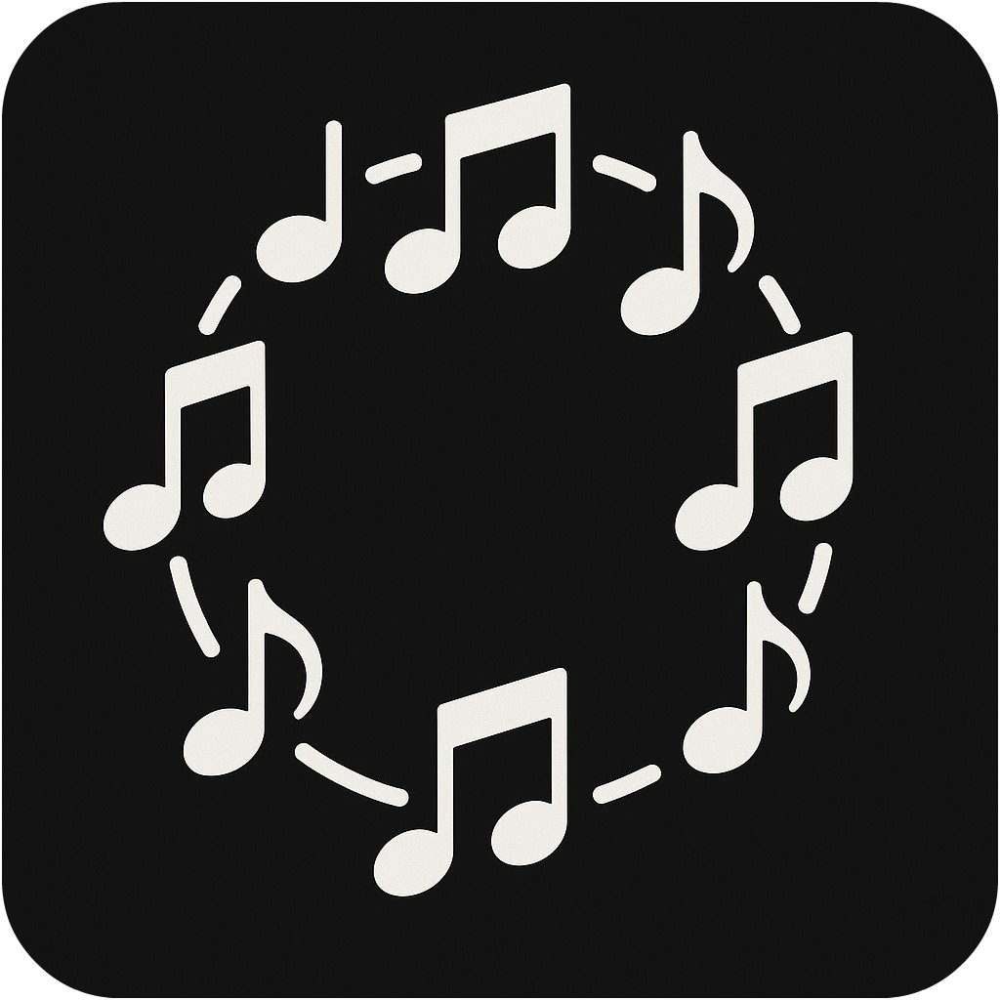
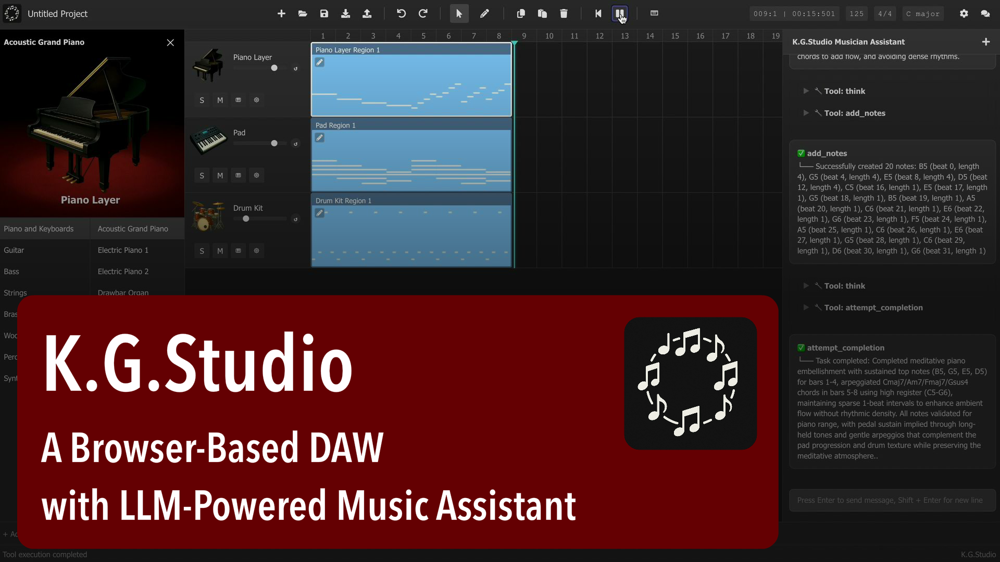
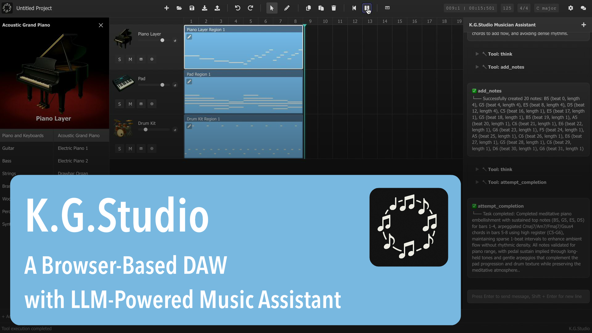

<div align="center">
  
</div>

## K.G.Studio — A Browser-based DAW with AI Assistant

K.G.Studio is a lightweight, modern DAW that runs entirely in the browser with **K.G.Studio Musician Assistant** at its core. It features realistic instrument playback via Tone.js samplers, a piano‑roll editor, track and region management with full undo/redo, project persistence to IndexedDB, a configurable settings panel, and an integrated AI assistant with tool execution.

**K.G.Studio Musician Assistant** is an AI assistance agent for harmony, arrangement, and note editing — but not full auto‑composition.

## Latest Updates

- **2025.12.21**: Implemented MIDI keyboard support! You can now connect a MIDI keyboard and use it to play sounds. Please note that this feature may not work optimally in Safari and some other browsers that lack complete Web MIDI interface support.
- **2025.12.15**: Added Intelligent Chord Assistant with functional harmony guidance (T/S/D). Hover over piano keys to see context-aware chord suggestions and create full chords with one click!

## Project Status

**K.G.Studio is an experimental project in early development.** We're exploring the possibilities of integrating AI agents and LLMs into music production workflows — essentially building a "Cursor or Claude Code for DAW" experience. 

This project investigates how AI-human collaboration can enhance creative music-making, from intelligent harmony suggestions to automated editing tasks. As an experimental platform, expect frequent changes, evolving features, and occasional instability as we push the boundaries of what's possible in AI-assisted music production.

### Start using the app online: [K.G.Studio (kgaudiolab.github.io/kgstudio)](https://kgaudiolab.github.io/kgstudio)

## Demo Videos

<div align="center">
  <table>
    <tr>
      <td align="center">
        <a href="https://youtu.be/FXgihfAH2vc" target="_blank">
          
        </a>
        <br><b>📱 Short Demo</b>
      </td>
      <td align="center">
        <a href="https://youtu.be/vKbWAQRt0r0" target="_blank">
          
        </a>
        <br><b>🎬 Full Demo</b>
      </td>
    </tr>
  </table>
</div>

## Quick Start

### Setting up K.G.Studio Musician Assistant
  - Click here to start using the app online: [K.G.Studio (kgaudiolab.github.io/kgstudio)](https://kgaudiolab.github.io/kgstudio)
  - [Click here to get a free OpenRouter API Key](https://openrouter.ai/keys) (you may need an OpenRouter account).
  - In **Settings ⚙️ → General → LLM Provider**, select **OpenAI Compatible**.
  - In **OpenAI Compatible Server → Key**, paste your key. (Note: on non‑localhost, your key isn’t persisted; you’ll re‑enter it after refresh the page. Keep it safe.)
  - In **OpenAI Compatible Server → Model**, enter `qwen/qwen3-30b-a3b:free` or `qwen/qwen3-235b-a22b:free`. (Note: these are free models [qwen3-30b-a3b](https://openrouter.ai/qwen/qwen3-30b-a3b:free) and [qwen3-235b-a22b](https://openrouter.ai/qwen/qwen3-235b-a22b:free); non‑free models may require billing; some model providers may retain your data, check their privacy policies; this project is not affiliated with OpenRouter or any model provider.)
  - In **OpenAI Compatible Server → Base URL**, enter `https://openrouter.ai/api/v1/chat/completions`.

(Alternatively, you can use the official OpenAI API, other OpenAI‑compatible services, or your own hosted LLM server. e.g., Ollama, vLLM)

### Basic DAW operations
  - Double‑click (or hold Ctrl/Cmd and click) on a track to create a region.
  - Drag region edges to resize; drag the body to move.
  - Click the small pencil at a region’s top‑left to open the piano roll.
  - In the piano roll, double‑click (or Ctrl/Cmd+click) to create a note.
  - Click to select; Shift+click for multi‑select; drag to box‑select.
  - Drag note edges to resize; drag the note body to move selected notes.
  - Use Snapping in the piano roll toolbar (top‑right) to quantize to grid.

### Using K.G.Studio Musician Assistant
  - Select the music region you want the assistant to work on, type your prompt in the chatbox; press Enter to send, Shift+Enter to insert a new line.
  - The agent will automatically process your request and invoke tools to make modifications scoped to the selected region. It may take one or more turns to complete a task.
  - Note that the AI could make mistakes, so you should always check the result and make adjustments if necessary. You can also use undo/redo to revert the changes.
  - Click the "+" button or `/clear` command to clear the chat history.

### More details

You can find the detailed user guide [here](./docs/USER_GUIDE.md).

### Highlights
- **K.G.Studio Musician Assistant**: Chat with the LLM‑powered K.G.Studio Musician Assistant AI Agent; it can automatically execute tools to make music edits.
- **Intelligent Chord Assistant**: Real-time chord suggestions based on functional harmony (Tonic/Subdominant/Dominant) with visual preview and one-click chord creation.
- **Multiple LLM providers**: OpenAI, Claude (via OpenRouter), Gemini (via OpenRouter), or OpenAI‑compatible (e.g., Ollama, OpenRouter).
- **Track & Region editing**: Add/reorder tracks, create/move/resize regions, copy/paste regions, and more.
- **Piano roll**: Create and edit notes with snapping/quantization support.
- **Real instruments**: Tone.js‑based Sampler with high‑quality FluidR3 soundfonts.
- **Undo/Redo everywhere**: Command pattern for tracks, regions, notes, and project properties
- **Persistence with privacy**: Save/load projects and configuration in your browser's IndexedDB (on your device).
- **Export/Import**: Export your project as a MIDI file, or import a MIDI file into your project.
- **Settings**: LLM provider, AI agent custom instructions, app behavior, and more.

For a deeper technical overview, see [overview.md](./docs/technical/overview.md).

## Getting Started

### Or clone and run locally:
```bash
# Make sure you have Node.js >= 20.19.3 installed
# Clone the repository
git clone https://github.com/KGAudioLab/KGStudio {your-local-path}
cd {your-local-path}

# Install dependencies
npm install

# Run the development server
npm run dev
```

## Configuration

K.G.Studio loads defaults from `./public/config.json` (with an internal fallback) and persists user edits in the browser via `ConfigManager` + IndexedDB. IndexedDB is your browser’s own local database stored on your device; it does not leave your machine and is cleared if you clear this site’s data. Modify settings via the in‑app Settings panel.

- **General**
  - LLM provider: OpenAI, or OpenAI‑compatible
  - API keys and models for the selected provider
  - OpenAI‑compatible base URL (for self‑hosted gateways)
  - Soundfont base URL (CDN for instrument samples)
- **Behavior**
  - Chatbox default open on startup
- **Templates**
  - Custom instructions used by the AI assistant

### Connectivity & Privacy

- K.G.Studio is fully client‑side. No first‑party servers are required to run the app.
- All projects, configuration, and UI state are stored in your browser’s IndexedDB (on your device).
- Network access is only used for:
  - Downloading instrument sound samples from the configured soundfont CDN
  - Communicating with the LLM provider you select (e.g., OpenAI or OpenAI‑compatible services)
- Outside of the two cases above, the app functions locally. If you block those endpoints, the app still loads; instrument playback and AI features will not function until network access is restored.
- For security, when running from a non‑local host we do not persist your API key in IndexedDB (to reduce XSS risk). You’ll be prompted to enter it each time you start K.G.Studio.

## Using the App

You can find the detailed user guide [here](./docs/USER_GUIDE.md).

- Tracks
  - Add, rename, and reorder tracks from the track info panel.
  - Change instrument using the instrument button (piano icon); adjust Solo (S), Mute (M), and Volume.
  - Delete a track from the track’s settings menu (button to the right of the instrument).

- Regions
  - Create region: with the Pointer tool, double‑click; or hold Ctrl/Cmd and click. With the Pencil tool, single‑click.
  - Move/resize: drag the body to move; drag edges to resize.
  - Open Piano Roll via the small pencil at a region’s top‑left.

- Piano Roll (MIDI notes)
  - Tools: Select vs Pencil.
  - Create notes: double‑click or Ctrl/Cmd+click (Select); single‑click (Pencil).
  - Select notes: click; Shift+click for multi‑select; drag to box‑select.
  - Move/resize: drag note body to move selected notes; drag edges to resize.
  - Close the piano roll with X or ESC.

- Intelligent Chord Assistant (Added 2025-12-15)
  - Enable chord guide from the piano roll toolbar: select T (Tonic), S (Subdominant), or D (Dominant) function.
  - Hover over any key to see context-aware chord suggestions highlighted in red, matching your selected key signature and mode.
  - Press Tab to cycle through different chord voicings for the same harmonic function.
  - Double-click (or Ctrl/Cmd+click) on a highlighted chord to create all notes at once.
  - Chord length automatically matches your last edited note for consistent rhythm.

- Snapping and Quantize
  - Set snapping from the NO SNAP menu (top‑right).
  - Quantize timing with Qua. Pos. (start) and Qua. Len. (length).

- Playback & Playhead
  - Back to beginning; Play/Pause from the toolbar.
  - Set the playhead by clicking bar numbers in the main grid; in Piano Roll, click the header timeline (respects snapping).
  - Change BPM, time signature, and key signature via the toolbar readouts.

## Keyboard Shortcuts

- Main
  - Play/Pause: Space
  - Undo / Redo: Ctrl/Cmd+Z / Ctrl/Cmd+Shift+Z
  - Copy / Cut / Paste: Ctrl/Cmd+C / Ctrl/Cmd+X / Ctrl/Cmd+V
  - Save: Ctrl/Cmd+S
  - Hold to create region: Ctrl/Cmd
- Piano Roll
  - Tools: Select (Q), Pencil (W)
  - Hold to create note: Ctrl/Cmd
  - Snap: 1(None), 2(1/4), 3(1/8), 4(1/16)
  - Quantize Position: 5(1/4), 6(1/8), 7(1/16)
  - Quantize Length: 8(1/4), 9(1/8), 0(1/16)

## AI Assistant

### Using K.G.Studio Musician Assistant

- Make sure you have followed the previous section to set up the LLM provider.
- You can find the K.G.Studio Musician Assistant chatbox on the right. If you don't see it, you can click the Chat 🗨️ button on the toolbar.
- Select the region you want the assistant to work on, type your prompt in the chatbox; press Enter to send, Shift+Enter to insert a new line.
- The agent will automatically process your request and invoke tools to make modifications scoped to the selected region. It may take one or more turns to complete a task.
- Note that the AI could make mistakes, so you should always check the result and make adjustments if necessary. You can also use undo/redo to revert the changes.
- Click the "+" button or `/clear` command to clear the chat history.

### Configuring Your LLM Provider

Navigate to **Settings ⚙️ → General → LLM Provider**. Depending on your chosen provider, you will need to supply the appropriate API Key and, if applicable, a custom base URL (for non-official OpenAI-compatible services such as Ollama, OpenRouter, etc.).

Note: due to CORS limitations with some providers, Google Gemini and Anthropic Claude are currently supported via OpenRouter only.

### Using OpenAI models

1. Obtain an OpenAI API Key from [**OpenAI**](https://platform.openai.com/account/api-keys). You may need to create an account and add a payment method to generate an API Key.
2. In **Settings ⚙️ → General → LLM Provider**, select **OpenAI** as your provider.
3. Enter your API Key in **OpenAI → Key**.
4. Select your preferred model from the **OpenAI → Model** dropdown. For a good balance between performance and cost, we recommend `gpt-5-mini`.
5. Optionally, choose whether to enable Flex Mode in **OpenAI → Flex Mode**. Flex Mode offers discounted pricing, but may result in slower response times or server-side errors.

### Using OpenRouter

OpenRouter is a platform that provides unified access to a wide range of language models—including free options—from various providers. This makes it easy to experiment and find the model that best suits your needs.

1. Obtain an API Key from [**OpenRouter**](https://openrouter.ai/keys). Registration is required; for paid models, a payment method may also be necessary.
2. In **Settings ⚙️ → General → LLM Provider**, select **OpenAI Compatible** as your provider.
3. Enter your API Key in **OpenAI Compatible Server → Key**.
4. Browse available models on the [**OpenRouter Models Page**](https://openrouter.ai/models). Use the "Prompt Pricing" filter to identify free models.  
   **Note:** Each model provider may have different data retention and privacy policies. Please review these policies before use.
5. Enter your chosen model name in **OpenAI Compatible Server → Model**. Recommended model series include:
    - `Anthropic: claude-4-sonnet` (`anthropic/claude-sonnet-4`: [Link](https://openrouter.ai/anthropic/claude-sonnet-4))
    - `Qwen: qwen3-30b-a3b` (FREE MODEL: `qwen/qwen3-30b-a3b:free`: [Link](https://openrouter.ai/qwen/qwen3-30b-a3b:free))
    - `Qwen: qwen3-235b-a22b` (FREE MODEL: `qwen/qwen3-235b-a22b:free`: [Link](https://openrouter.ai/qwen/qwen3-235b-a22b:free))
6. Input the base URL `https://openrouter.ai/api/v1/chat/completions` **OpenAI Compatible Server → Base URL**.

### About the agent and LLM providers

Currently, based on our evaluation, OpenAI’s open‑source models (`gpt‑oss‑20b` and `gpt‑oss‑120b`) are not yet compatible with the current agent implementation; support is planned.

For security, when using K.G.Studio from a non‑local host, API keys are not persisted in IndexedDB; you will need to input your API key each time you start K.G.Studio.

K.G.Studio does not provide or host any of the models listed above, nor is it affiliated with any model provider. All data is stored locally on your device; K.G.Studio does not collect or transmit your data. You are solely responsible for any data you provide to third‑party model providers.

## Upcoming Features

Feature priorities might change.

- [X] More instruments
- [X] Automated testing (unit tests, integration tests, etc.)
- [X] Intelligent Chord Assistant with functional harmony guidance (T/S/D)
- [ ] Support track control automations (e.g. sustain, volume, pan, etc.)
- [ ] Support MIDI control events (e.g. CC, pitch bend, etc.)
- [ ] Support WAV audio tracks
- [ ] Filters and effects
- [ ] MCP Support
- [ ] Add support for OpenAI's open source models (`gpt-oss-20b` and `gpt-oss-120b`)
- [ ] Automatically compact conversations when the context window runs low on space

## Help Needed

We're looking for contributors to help make K.G.Studio even better! Whether you're a developer, musician, or designer, your expertise can make a real difference.

### How You Can Help

**🎵 Musicians & Music Producers**
- Test the DAW with real-world music production workflows
- Provide feedback on instrument quality and realism
- Suggest missing features that are essential for music creation
- Help improve the AI assistant's musical understanding

**💻 Developers**
- Implement new features from our roadmap
- Fix bugs and improve performance
- Enhance the Web Audio integration
- Work on AI assistant capabilities

**🎨 UI/UX Designers**
- Improve the user interface and workflow
- Design better visual feedback for music editing
- Create more intuitive interactions

### Get Involved

Interested in contributing? We'd love to hear from you!

- **Email us**: [kgstudio@duck.com](mailto:kgstudio@duck.com)
- **Check our Issues**: Browse open issues labeled with `help wanted` or `good first issue`
- **Join Discussions**: Share ideas and feedback in GitHub Discussions

No contribution is too small — from reporting bugs to suggesting new features, every bit of help moves the project forward!

### Disclaimer

K.G.Studio is an experimental project in early development. We're exploring the possibilities of integrating AI agents and LLMs into music production workflows — essentially building a "Cursor or Claude Code for DAW" experience. 

This project investigates how AI-human collaboration can enhance creative music-making, from intelligent harmony suggestions to automated editing tasks. As an experimental platform, expect frequent changes, evolving features, and occasional instability as we push the boundaries of what's possible in AI-assisted music production.

K.G.Studio does not provide or host any of LLM models, nor is it affiliated with any model provider. All data is stored locally on your device; K.G.Studio does not collect or transmit your data. You are solely responsible for any data you provide to third-party model providers.

## License

Licensed under the Apache License, Version 2.0, with additional terms (see `LICENSE`):
- No patent applications using this software or assets
- Attribution required when used in public/commercial products (“Powered by K.G.Studio”)  

Third‑party notices (e.g., FluidR3_GM SoundFont, midi‑js‑soundfonts, and prompt structure notes) are included in `LICENSE`.
