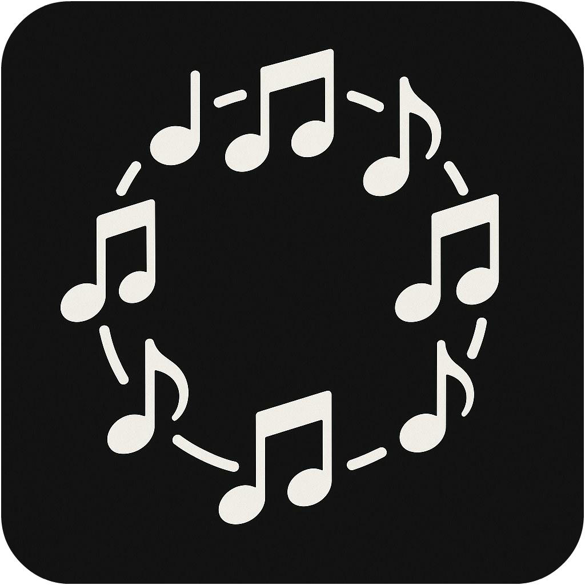
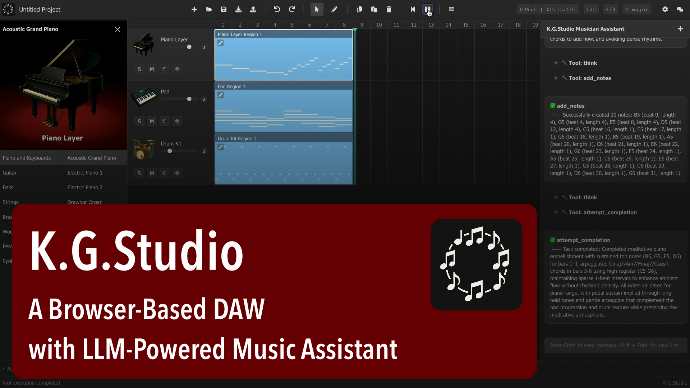
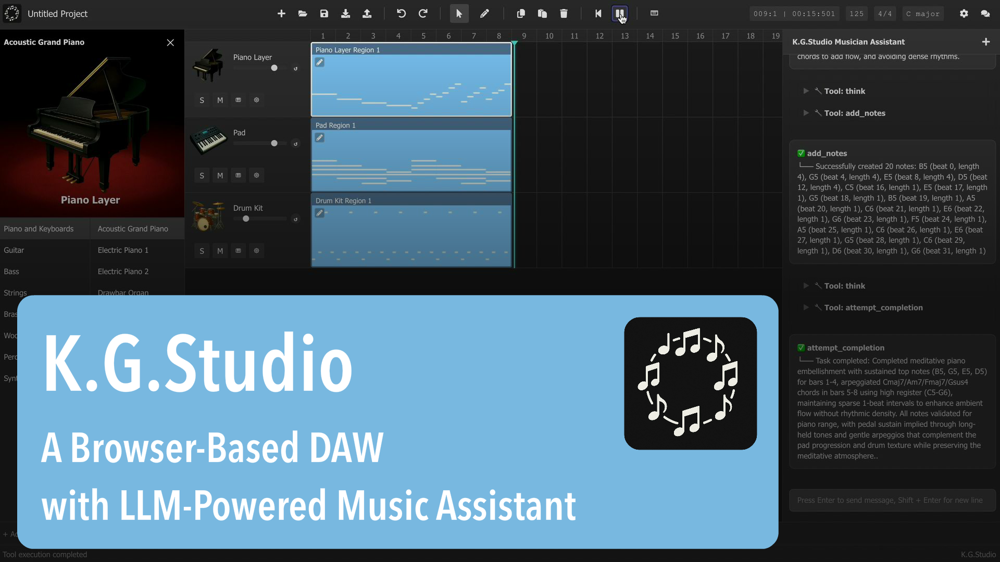

English | [Français](./README-fr.md) | [简体中文](./README-zh_cn.md) | [繁體中文](./README-zh_hk.md)

<div align="center">
  
</div>

# K.G.Studio — A Browser-based DAW with AI Assistant

<div align="center">
  <h3><a href="https://kgaudiolab.github.io/kgstudio"><b>◀ Start using K.G.Studio online inside of your browser ▶</b></a></h3>
</div>

## What is K.G.Studio?

K.G.Studio is a lightweight, modern DAW that runs entirely in the browser with **K.G.Studio Musician Assistant** at its core. It features realistic instrument playback via Tone.js samplers, a piano‑roll editor, track and region management with full undo/redo, project persistence to OPFS (Origin Private File System), a configurable settings panel, and an integrated AI assistant with tool execution.

**K.G.Studio Musician Assistant** is a project-aware AI co-creator designed to elevate your creative workflow. Rather than generating raw audio files, it operates directly at the structured track and note level—helping you draft melodies, build harmonic progressions, and edit MIDI notes, while leaving you in complete control to adjust, fine-tune, and perfect every single detail.

## Latest Updates

- **2026.07.18**: Introduced powerful new MIDI arrangement and editing workflows:
  - **Flexible, key-aware transposition** — apply independent transpose settings at the track or region level, shift material by up to three octaves, and optionally follow key-signature changes. Chord-track content can now be transposed automatically when the project key or a key-signature region changes, preserving harmonic intent across the arrangement.
  - **MIDI Reference mode** — overlay a second MIDI region as a read-only, timeline-aligned reference in the piano roll, making it easier to coordinate melodies, harmonies, voicings, and rhythmic relationships while editing another part.
  - **Miscellaneous enhancements** — refined playhead visibility and navigation, sticky global tracks, configurable track duplication, key-aware staff-notation spelling, and improved editor menu layering.

- **2026.07.12**: Expanded MIDI creation, editing, and playback workflows:
  - **Intelligent Arpeggiator** — learn a pattern from example notes and generate chord- or MIDI-driven variations while preserving chromatic source pitches, with atomic undo support.
  - **Faster MIDI editing and export** — select notes by pitch rank across configurable ranges, and export individual regions, complete tracks, or the full project as standard MIDI files.
  - **Persistent custom instruments** — build reusable instruments from WAV or MP3 samples with per-pitch mapping, previews, configurable ranges, built-in fallbacks, and seamless playback and MIDI export integration.
  - **A more focused editor** — the piano roll now docks beneath the timeline with a resizable layout, while sticky track controls remain accessible during horizontal scrolling.
  - **More reliable playback and notation** — solo now overrides mute, audio tracks can be unmuted during playback, and bass-clef rests render in the correct staff position.

- **2026.06.05**: Significantly expanded the **K.G.Studio Musician Assistant** into a full project-level agent:
  - **Track management tools** — the agent can now list, create, update, and delete tracks, and browse all available instruments, without requiring a region to be selected first.
  - **Global track tools** — full read/write/remove access to all four global tracks: **Chord Progression**, **Tempo (BPM)**, **Key Signature**, and **Markers**. The agent can restructure an entire arrangement's harmonic and rhythmic skeleton in a single conversation.
  - **Tool confirmation** — write operations surface a confirmation step in the chat before executing, giving you a chance to review before anything changes.
  - **Agent todo list** — the assistant now maintains an inline task checklist rendered as live snapshot cards directly in the chat, making multi-step plans transparent and trackable.
  - **Conversation history** — chat sessions are persisted per project and can be resumed across page reloads.
  - **Automatic context compaction** — long conversations are summarised automatically when the context limit approaches, keeping sessions running without manual intervention.
  - **Efficient agent mode** — a streamlined prompt and reduced tool set for smaller / local language models, activated automatically when using the Local Browser LLM.

- **2026.05.30**: Added **internationalization (i18n) support** — K.G.Studio now ships in four languages: **English**, **Simplified Chinese (简体中文)**, **Traditional Chinese (繁體中文)**, and **French (Français)**. The active language can be configured under **Settings ⚙️ → General → Language**, with an `Auto` option that automatically detects your browser's locale.

- **2026.05.27**: 
  - Added **Global Track System** — introduce four global tracks: **Marker**, **Tempo**, **Key Signature**, and **Chord** (chord-symbol span regions). 
  - Added **Audio Chord Detection** feature — open piano roll window for an audio or a MIDI region and click "..." -> **Detect Chords** to automatically analyse the recording and populate the Chord Track using a zero-dependency FFT pipeline with configurable sensitivity, stability, and seventh-chord detection. 
  - Added **Tempo Detection with Auto-Align Beats** feature — open piano roll window for an audio region and click "..." -> **Detect Tempo** in the toolbar to analyse the audio for BPM and optionally realign the project's Tempo Track regions to match. 
  - Added **Demucs 4S** as a second local browser-embedded stem-separation model — the existing two-stem UVR-MDX-NET model is now joined by the four-stem `htdemucs_4s` model (~172 MB, vocals / drums / bass / others), both running entirely in-browser via ONNX Runtime WebGPU.

- **2026.05.15**: Added **browser-embedded AI models** — two AI models now run entirely in the browser with no external service, no API key, and no K.G.One server required. The **K.G.Studio Musician Assistant** gains a new **Local LLM (Browser)** provider powered by **Gemma 4 E4B** via LiteRT-LM with WebGPU acceleration; the model is downloaded once and cached in OPFS for instant subsequent launches, with configurable context length (32 k / 64 k / 128 k tokens) and live inference performance statistics. **Stem separation** now also runs locally through a browser-embedded **UVR-MDX-NET-Inst_HQ_3** ONNX model with WebGPU acceleration — open the **Music Generator** panel (✦ button), download the model once, and separate vocals from instruments entirely on-device. Both features require a WebGPU-capable browser (Chrome 113+ or Edge 113+) and a secure context (HTTPS or localhost). Recommended hardware: a GPU with at least 8 GB VRAM or a system with at least 16 GB unified RAM.

- **2026.05.10**: Added **staff notation (sheet music) view** — the piano roll now offers a full standard notation mode. Switch between Piano Roll and Sheet Music views using the toggle in the piano roll toolbar. In sheet music mode, notes are engraved via VexFlow with automatic clef selection (treble or bass) based on the active instrument, key signature rendering, automatic beam grouping, ties across bar lines, and configurable quantization for note-value resolution. Enable **Track Scope** to render all MIDI regions on the track as a continuous score rather than a single isolated region.

- **2026.05.09**: Added **audio recording** — record directly from your microphone into an audio track. A live waveform preview grows in real time as you record, and the region is committed to the timeline as a standard audio region when you stop. Added **audio I/O device selection** in Settings so you can choose your preferred microphone input and audio output device.

For the full release history, see [**Release Notes**](./docs/RELEASE_NOTES.md).

## Project Status

**K.G.Studio is an experimental project in early development.** We're exploring the possibilities of integrating AI agents and LLMs into music production workflows — essentially building a "Cursor or Claude Code for DAW" experience. 

This project investigates how AI-human collaboration can enhance creative music-making, from intelligent harmony suggestions to automated editing tasks. As an experimental platform, expect frequent changes, evolving features, and occasional instability as we push the boundaries of what's possible in AI-assisted music production.

## Demo Videos

<div align="center">
  <table>
    <tr>
      <td align="center">
        <a href="https://youtu.be/FXgihfAH2vc" target="_blank">
          
        </a>
        <br><b>Short Demo (DAW Only)</b>
      </td>
      <td align="center">
        <a href="https://youtu.be/vKbWAQRt0r0" target="_blank">
          
        </a>
        <br><b>Full Demo (DAW Only)</b>
      </td>
    </tr>
  </table>
</div>

## Quick Start

### Setting up K.G.Studio Musician Assistant

There are two ways to use K.G.Studio Musician Assistant: **Local LLM (Browser)** — runs entirely in your browser with no API key, no cost, and no data leaving your device — or an **external LLM provider** for higher-quality responses.

#### Option A: Local LLM (Browser) — No API Key Required ✦

K.G.Studio can run **Gemma 4 E4B** entirely inside your browser using WebGPU acceleration. No API calls are made, no cost is incurred, and your data never leaves your machine.

  - Click here to start using the app online: [K.G.Studio (kgaudiolab.github.io/kgstudio)](https://kgaudiolab.github.io/kgstudio)
  - In **Settings ⚙️ → Music Assistant → LLM Provider**, select **Local LLM (Browser)** (this is the default).
  - The model (~2.8 GB) downloads automatically the first time you open the chat and is cached in your browser's OPFS (Origin Private File System) for instant subsequent launches.
  - Optionally, configure the **Context Length** (32k / 64k / 128k tokens) — larger values require more VRAM.
  - Start chatting! No key, no account, no network traffic after the initial model download.

**Requirements for Local LLM:** A WebGPU-capable browser (Chrome 113+ or Edge 113+) running in a secure context (HTTPS or localhost). Recommended hardware: a GPU with at least 8 GB VRAM, or a system with at least 16 GB unified RAM.

> **Note:** The local model's quality cannot be compared to commercial models like GPT or Claude series. For complex music editing tasks, an external provider will generally produce better results.

#### Option B: External LLM Provider (Higher Quality)

  - Click here to start using the app online: [K.G.Studio (kgaudiolab.github.io/kgstudio)](https://kgaudiolab.github.io/kgstudio)
  - [Get an OpenRouter API key](https://openrouter.ai/keys) (an OpenRouter account is required).
  - In **Settings ⚙️ → Music Assistant → LLM Provider**, select **OpenAI Compatible**.
  - In **LLM Provider (OpenAI Compatible) → Key**, paste your key. (Note: on non‑localhost, your key isn't persisted by default for security; you can enable "Persist API Keys on Non-Localhost" in Settings to persist them, though this may increase XSS risk.)
  - In **LLM Provider (OpenAI Compatible) → Model**, enter the model ID of your choice from the [OpenRouter Models Page](https://openrouter.ai/models). Check its pricing and data policies before use; K.G.Studio is **not** affiliated with OpenRouter or any model provider.
  - In **LLM Provider (OpenAI Compatible) → Base URL**, enter `https://openrouter.ai/api/v1`.

**Tips:**
- You can also use the official OpenAI API, other OpenAI-compatible services, or a self-hosted LLM server (e.g., Ollama, vLLM). Note that model quality varies — not all models perform equally well for music editing tasks. For self-deployment (requiring ~24G VRAM or 24-32GB Unified Memory), we recommend: `qwen/qwen3.6-35b-a3b`, `google/gemma-4-26b-a4b-it`, or `google/gemma-4-31b-it`.
- If you have an active subscription with OpenAI or another LLM provider, you can use [CLIProxyAPI](https://github.com/router-for-me/CLIProxyAPI) to run a local proxy server that routes requests through your existing subscription, without needing a separate API key.

### Basic DAW operations
  - Double‑click (or hold Ctrl/Cmd and click) on a track to create a region.
  - Drag region edges to resize; drag the body to move.
  - Click the small pencil at a region’s top‑left to open the piano roll.
  - In the piano roll, double‑click (or Ctrl/Cmd+click) to create a note.
  - Click to select; Shift+click for multi‑select; drag to box‑select.
  - Drag note edges to resize; drag the note body to move selected notes.
  - Use Snapping in the piano roll toolbar (top‑right) to quantize to grid.

### Using K.G.Studio Musician Assistant
  - Select the music region you want the assistant to work on, type your prompt in the chatbox; press Enter to send, Shift+Enter to insert a new line.
  - The agent will automatically process your request and invoke tools to make modifications scoped to the selected region. It may take one or more turns to complete a task.
  - Note that the AI could make mistakes, so you should always check the result and make adjustments if necessary. You can also use undo/redo to revert the changes.
  - Click the "+" button or `/clear` command to clear the chat history.

### More details

You can find the detailed user guide [here](./docs/USER_GUIDE.md).

### Highlights
- **K.G.Studio Musician Assistant**: Chat with the LLM‑powered AI agent; it automatically executes tools to make music edits scoped to your selected region.
- **Browser-embedded LLM — no API key required**: Run **Gemma 4 E4B** entirely in your browser via WebGPU (LiteRT-LM). No API calls, no cost, no data leaving your device. Model is downloaded once and cached locally.
- **Browser-embedded stem separation — no server required**: Split any audio region into stems using **UVR-MDX-NET-Inst_HQ_3** (2-stem: Vocals / Instrumental) or **Demucs htdemucs_4s** (4-stem: Vocals / Drums / Bass / Others) — both run entirely in-browser via ONNX Runtime WebGPU.
- **Audio chord detection**: Open the piano roll on an audio region and run **Detect Chords** to automatically analyse the recording and populate the global Chord Track using a zero-dependency FFT pipeline, with configurable sensitivity, stability, and seventh-chord detection.
- **Tempo detection with auto-align beats**: Run **Detect Tempo** in the piano roll toolbar to analyse an audio region for BPM and optionally realign the project's Tempo Track to match.
- **Global Track System**: Four persistent global tracks — **Marker**, **Tempo**, **Key Signature**, and **Chord** — provide project-wide structure that all features (playback timing, chord detection, sheet notation) reference.
- **Multiple LLM providers**: OpenAI, Claude / Gemini (via OpenRouter), OpenAI-compatible (Ollama, vLLM, etc.), or the built-in Local Browser LLM — no key required.
- **Track & Region editing**: Add/reorder tracks, create/move/resize regions, multi-select with lasso, bulk move/resize, merge & split regions, and full undo/redo.
- **Piano roll**: Notes, pitch bend, and MIDI CC automation lanes; staff notation (sheet music) view via VexFlow; spectrogram overlay for audio-to-MIDI reference.
- **Real instruments**: Tone.js‑based sampler with high-quality FluidR3 soundfonts. Record audio directly from your microphone into an audio track.
- **Intelligent Chord Assistant**: Real-time chord suggestions based on functional harmony (T/S/D) with visual preview and one-click chord creation.
- **Persistence with privacy**: Projects and configuration saved entirely in your browser (OPFS / IndexedDB). No first-party servers.

For a deeper technical overview, see [overview.md](./docs/technical/overview.md).

## Getting Started

### Or clone and run locally:
```bash
# Make sure you have Node.js >= 20.19.3 installed
# Clone the repository
git clone https://github.com/KGAudioLab/KGStudio {your-local-path}
cd {your-local-path}

# Install dependencies
npm install

# Run the development server
npm run dev
```

## Configuration

K.G.Studio loads defaults from `./public/config.json` (with an internal fallback) and persists user edits in the browser via `ConfigManager` + IndexedDB. IndexedDB is your browser’s own local database stored on your device; it does not leave your machine and is cleared if you clear this site’s data. Modify settings via the in‑app Settings panel.

- **General**
  - Soundfont base URL (CDN for instrument samples)
- **Music Assistant**
  - LLM provider: OpenAI, or OpenAI‑compatible
  - API keys and models for the selected provider
  - Persist API Keys on Non-Localhost: Enable to persist API keys on non-localhost environments (security opt-in, not recommended for shared/production environments)
  - OpenAI‑compatible base URL (for self‑hosted gateways)
- **Behavior**
  - Chatbox default open on startup
- **Templates**
  - Custom instructions used by the AI assistant

### Connectivity & Privacy

- K.G.Studio is fully client‑side. No first‑party servers are required to run the app.
- Projects and audio files are stored in your browser’s OPFS (Origin Private File System); configuration is stored in IndexedDB. All data stays on your device.
- Network access is only used for:
  - Downloading instrument sound samples from the configured soundfont CDN
  - Communicating with the LLM provider you select (e.g., OpenAI or OpenAI‑compatible services)
- Outside of the two cases above, the app functions locally. If you block those endpoints, the app still loads; instrument playback and AI features will not function until network access is restored.
- For security, when running from a non‑local host we do not persist your API key in IndexedDB by default (to reduce XSS risk). You'll be prompted to enter it each time you start K.G.Studio. To opt‑in to persistence on non‑local hosts, enable "Persist API Keys on Non-Localhost" in Settings (not recommended for shared/production environments).

## Using the App

You can find the detailed user guide [here](./docs/USER_GUIDE.md).

- Tracks
  - Add, rename, and reorder tracks from the track info panel.
  - Change instrument using the instrument button (piano icon); adjust Solo (S), Mute (M), and Volume.
  - Delete a track from the track’s settings menu (button to the right of the instrument).

- Regions
  - Create region: with the Pointer tool, double‑click; or hold Ctrl/Cmd and click. With the Pencil tool, single‑click.
  - Move/resize: drag the body to move; drag edges to resize.
  - Open Piano Roll via the small pencil at a region’s top‑left.

- Piano Roll (MIDI notes)
  - Tools: Select vs Pencil.
  - Create notes: double‑click or Ctrl/Cmd+click (Select); single‑click (Pencil).
  - Select notes: click; Shift+click for multi‑select; drag to box‑select.
  - Move/resize: drag note body to move selected notes; drag edges to resize.
  - **Sheet music view**: toggle between Piano Roll and Staff Notation views from the piano roll toolbar. Supports automatic clef selection, key signature rendering, beam grouping, ties, and configurable quantization. Enable **Track Scope** to render all regions on the track as a continuous score.
  - **Automation lanes**: draw and edit pitch bend and MIDI CC curves (Modulation, Breath, Volume, Expression, Sustain) in the editable lane below the piano grid.
  - **Spectrogram mode**: view an audio region's spectrogram inside the piano roll as a reference layer while editing MIDI notes.
  - Close the piano roll with X or ESC.

- Intelligent Chord Assistant (Added 2025-12-15)
  - Enable chord guide from the piano roll toolbar: select T (Tonic), S (Subdominant), or D (Dominant) function.
  - Hover over any key to see context-aware chord suggestions highlighted in red, matching your selected key signature and mode.
  - Press Tab to cycle through different chord voicings for the same harmonic function.
  - Double-click (or Ctrl/Cmd+click) on a highlighted chord to create all notes at once.
  - Chord length automatically matches your last edited note for consistent rhythm.

- Snapping and Quantize
  - Set snapping from the NO SNAP menu (top‑right).
  - Quantize timing with Qua. Pos. (start) and Qua. Len. (length).

- Playback & Playhead
  - Back to beginning; Play/Pause from the toolbar.
  - Set the playhead by clicking bar numbers in the main grid; in Piano Roll, click the header timeline (respects snapping).
  - Change BPM, time signature, and key signature via the toolbar readouts.

## Keyboard Shortcuts

- Main
  - Play/Pause: Space
  - Undo / Redo: Ctrl/Cmd+Z / Ctrl/Cmd+Shift+Z
  - Copy / Cut / Paste: Ctrl/Cmd+C / Ctrl/Cmd+X / Ctrl/Cmd+V
  - Save: Ctrl/Cmd+S
  - Hold to create region: Ctrl/Cmd
- Piano Roll
  - Tools: Select (Q), Pencil (W)
  - Hold to create note: Ctrl/Cmd
  - Snap: 1(None), 2(1/4), 3(1/8), 4(1/16)
  - Quantize Position: 5(1/4), 6(1/8), 7(1/16)
  - Quantize Length: 8(1/4), 9(1/8), 0(1/16)

## AI Assistant

### Using K.G.Studio Musician Assistant

- Make sure you have followed the previous section to set up the LLM provider.
- You can find the K.G.Studio Musician Assistant chatbox on the right. If you don't see it, you can click the Chat 🗨️ button on the toolbar.
- Select the region you want the assistant to work on, type your prompt in the chatbox; press Enter to send, Shift+Enter to insert a new line.
- The agent will automatically process your request and invoke tools to make modifications scoped to the selected region. It may take one or more turns to complete a task.
- Note that the AI could make mistakes, so you should always check the result and make adjustments if necessary. You can also use undo/redo to revert the changes.
- Click the "+" button or `/clear` command to clear the chat history.

### Configuring Your LLM Provider

Navigate to **Settings ⚙️ → Music Assistant → LLM Provider**. Depending on your chosen provider, you will need to supply the appropriate API Key and, if applicable, a custom base URL (for non-official OpenAI-compatible services such as Ollama, OpenRouter, etc.).

Note: due to CORS limitations with some providers, Google Gemini and Anthropic Claude are currently supported via OpenRouter only.

### Using OpenAI models

1. Obtain an OpenAI API Key from [**OpenAI**](https://platform.openai.com/account/api-keys). You may need to create an account and add a payment method to generate an API Key.
2. Open **Settings ⚙️ → Music Assistant**, then click the **OpenAI** preset under **LLM Provider (OpenAI Compatible)**. This fills the connection fields and selects **OpenAI Compatible** mode.
3. Enter your API key in **LLM Provider (OpenAI Compatible) → Key**.
4. The preset sets Model to `gpt-6.1-sol`. You can edit it to use another model available to your account.

Connection presets are available for OpenAI, Claude (via OpenRouter), OpenRouter, Ollama, llama.cpp, and CLIProxyAPI. Clicking a preset replaces Key, Base URL, and Model and activates OpenAI Compatible mode. For supported ChatGPT or Claude subscriptions, [CLIProxyAPI](https://github.com/router-for-me/CLIProxyAPI) can provide a local compatible connection using your available subscription access. All presets clear the key. Enter your provider or server key if authentication is required.

### Using OpenRouter

OpenRouter is a platform that provides unified access to a wide range of language models from various providers. This makes it easy to experiment and find the model that best suits your needs.

1. Obtain an API Key from [**OpenRouter**](https://openrouter.ai/keys). Registration is required; for paid models, a payment method may also be necessary.
2. Open **Settings ⚙️ → Music Assistant** and click the **OpenRouter** preset under **LLM Provider (OpenAI Compatible)**.
3. Enter your API Key in **LLM Provider (OpenAI Compatible) → Key**.
4. Browse available models on the [**OpenRouter Models Page**](https://openrouter.ai/models) and compare their pricing and capabilities.
   **Note:** Each model provider may have different data retention and privacy policies. Please review these policies before use.
5. Enter your chosen model name in **LLM Provider (OpenAI Compatible) → Model**. Recommended model series include:
    - `Anthropic: Claude Sonnet 4.6` (`anthropic/claude-sonnet-4.6`: [Link](https://openrouter.ai/anthropic/claude-sonnet-4.6)) — best balance of quality and cost for the Claude series
    - For self-deployment (requiring ~24G VRAM or 24-32GB Unified Memory), we recommend:
        - `Qwen: Qwen3.6 35B A3B` (`qwen/qwen3.6-35b-a3b`: [Link](https://openrouter.ai/qwen/qwen3.6-35b-a3b))
        - `Google: Gemma 4 26B A4B IT` (`google/gemma-4-26b-a4b-it`: [Link](https://openrouter.ai/google/gemma-4-26b-a4b-it))
        - `Google: Gemma 4 31B IT` (`google/gemma-4-31b-it`: [Link](https://openrouter.ai/google/gemma-4-31b-it))
6. Input the base URL `https://openrouter.ai/api/v1` **LLM Provider (OpenAI Compatible) → Base URL**.

You can also browse the [OpenRouter Models Page](https://openrouter.ai/models) for currently available free models. Availability changes over time; K.G.Studio does not recommend specific free models for music editing.

### About the agent and LLM providers

For security, when using K.G.Studio from a non‑local host, API keys are not persisted in IndexedDB by default; you will need to input your API key each time you start K.G.Studio. To opt‑in to persistence on non‑local hosts, enable "Persist API Keys on Non-Localhost" in Settings (not recommended for shared/production environments).

K.G.Studio does not provide or host any of the models listed above, nor is it affiliated with any model provider. All data is stored locally on your device; K.G.Studio does not collect or transmit your data. You are solely responsible for any data you provide to third‑party model providers.

## AI Music Tools

The **AI Music Tools** panel extracts stems directly in your browser. Click the **✦ (magic wand)** button in the toolbar to open it. The panel has **Stem Extraction** and **Humanize** tabs. Opening this panel closes the AI Assistant chatbox.

### Stem Separation

Split an existing audio region into individual stems (e.g. vocals, instruments, drums).

Two ONNX models run entirely in your browser with no API calls, no cost, and no data leaving your device. The models are downloaded once and cached locally.

- **Vocal and Instrument (Medium Accuracy)** (`UVR-MDX-NET-Inst_HQ_3`, ~64 MB) — two-stem split (Vocals / Instrumental). Powered by [UVR-MDX-NET](https://github.com/nomadkaraoke/python-audio-separator).
- **Vocal, Drums, Bass, and Others** (`htdemucs_4s`, ~172 MB) — four-stem split (Vocals / Drums / Bass / Others). Powered by [Demucs](https://github.com/facebookresearch/demucs).

Open the **AI Music Tools** panel (✦ button in the toolbar), select a model, click **Download Selected Model** once, then click **Separate Stems** — everything runs locally in your browser.

**Requirements:** A WebGPU-capable browser (Chrome 113+ or Edge 113+) in a secure context (HTTPS or localhost). WebGPU acceleration is used when available; falls back to CPU (may reduce page responsiveness during processing). Recommended hardware: a GPU with at least 8 GB VRAM, or a system with at least 16 GB unified RAM.

#### Usage

- **Select an audio region** on the timeline before opening this tab. The selected region and its track name are shown at the top of the **Stem Extraction** tab. Only audio regions are supported — MIDI regions cannot be separated. In waveform or spectrogram view, **… → Stem Extraction…** opens this tab.
- Click **Separate Stems**. If the selected region has a clip start offset or is trimmed, the audio is automatically sliced to match the region range before processing.
- Once complete, each stem appears as a labelled preview player with a drag handle. You can preview each stem individually before importing.
- **To import stems**:
  - Drag each stem player individually onto an **audio track** to place it where you want.
  - Or click **Import All Stems to Timeline** to create one new audio track per stem automatically, positioned immediately below the source track and aligned to the same start beat as the original region. This is a single undoable operation.

### Humanize

Select a MIDI region on the timeline, then choose **… → Humanize…** to open **AI Music Tools → Humanize**. All configuration is visible directly in the tab. The tab follows timeline selection and displays provider and model-cache status, with buttons to download, redownload, or delete the selected model. AIRE generates editable expression for **CC1, CC2, CC7, or CC11**, preserving note timing and velocities. An enabled loop limits processing to its overlap with the region. Settings remain available for the app session; leaving the tab cancels processing. After completion, the generated controller lane opens in the piano roll.

## Upcoming Features

Feature priorities might change.

### 1.0

- [X] More instruments
- [X] Automated testing (unit tests, integration tests, etc.)
- [X] Intelligent Chord Assistant with functional harmony guidance (T/S/D)
- [X] Support track control automations (e.g. sustain, volume, pan, etc.)
- [X] Support MIDI control events (e.g. CC, pitch bend, etc.)
- [X] Support WAV audio tracks
- [X] Recording
- [X] Event List
- [X] Add support for OpenAI's open source models (`gpt-oss-20b` and `gpt-oss-120b`)
- [X] Staff notation
- [X] Browser-embedded AI models (on-device LLM via Gemma 4 E4B; on-device stem separation via UVR-MDX-NET-Inst_HQ_3 and htdemucs_4s)
- [X] Global Track System (Marker, Tempo, Key Signature, Chord)
- [X] Audio Chord Detection (zero-dependency FFT, populates Chord Track)
- [X] Tempo Detection with Auto-Align Beats
- [X] Spectrogram visualization and Piano Roll hybrid mode

### Post 1.0

- [X] Expanded AI agent tools — manipulate regions, tracks, and global tracks (chord progressions, tempo, key) directly from chat
- [ ] Mixer view — dedicated panel with per-track faders, sends, return buses, and master channel
- [ ] EQ and channel strip — per-track parametric EQ and compressor
- [ ] Filters and effects — reverb, delay, and other WebAudio-native insert effects
- [ ] Audio time-stretch / warp — stretch audio regions to match project tempo
- [ ] MIDI effects — arpeggiator, scale quantizer, chord memory
- [ ] Virtual MIDI device output

## Help Needed

We're looking for contributors to help make K.G.Studio even better! Whether you're a developer, musician, or designer, your expertise can make a real difference.

### How You Can Help

**🎵 Musicians & Music Producers**
- Test the DAW with real-world music production workflows
- Provide feedback on instrument quality and realism
- Suggest missing features that are essential for music creation
- Help improve the AI assistant's musical understanding

**💻 Developers**
- Implement new features from our roadmap
- Fix bugs and improve performance
- Enhance the Web Audio integration
- Work on AI assistant capabilities

**🎨 UI/UX Designers**
- Improve the user interface and workflow
- Design better visual feedback for music editing
- Create more intuitive interactions

### Get Involved

Interested in contributing? We'd love to hear from you!

- **Email us**: [kgstudio@duck.com](mailto:kgstudio@duck.com)
- **Check our Issues**: Browse open issues labeled with `help wanted` or `good first issue`
- **Join Discussions**: Share ideas and feedback in GitHub Discussions

No contribution is too small — from reporting bugs to suggesting new features, every bit of help moves the project forward!

### Disclaimer

K.G.Studio is an experimental project in early development. We're exploring the possibilities of integrating AI agents and LLMs into music production workflows — essentially building a "Cursor or Claude Code for DAW" experience. 

This project investigates how AI-human collaboration can enhance creative music-making, from intelligent harmony suggestions to automated editing tasks. As an experimental platform, expect frequent changes, evolving features, and occasional instability as we push the boundaries of what's possible in AI-assisted music production.

K.G.Studio does not provide or host any of LLM models, nor is it affiliated with any model provider. All data is stored locally on your device; K.G.Studio does not collect or transmit your data. You are solely responsible for any data you provide to third-party model providers.

## License

Licensed under the Apache License, Version 2.0, with additional terms (see `LICENSE`):
- No patent applications using this software or assets
- Attribution required when used in public/commercial products (“Powered by K.G.Studio”)  

Third‑party notices (FluidR3_GM SoundFont, midi‑js‑soundfonts, VexFlow, prompt structure notes, Gemma 4 E4B, UVR-MDX-NET-Inst_HQ_3, MediaPipe, Meyda, web-audio-beat-detector, tonal, htdemucs_4s, onnxruntime-web, and demucs-web) are included in `LICENSE`.

### AIRE MIDI expression

Humanize MIDI regions in **AI Music Tools → Humanize**, opened from the
piano-roll menu. AIRE generates editable CC1, CC2, CC7, or CC11 automation
locally, preserving note timing and velocity. Enable a
loop to process only its intersection with the region. Model downloads and cache
management are available in **Settings → General → AIRE Settings**.

Uses instrument-aire models by **xiaohan-tian / KGAudioLab**
(https://huggingface.co/KGAudioLab). The encoder and models use MIT + Attribution
Requirement; see [the retained license](src/util/aire/LICENSE). AIRE is inspired by
[MID-FiLD](https://ojs.aaai.org/index.php/AAAI/article/view/27774), and its models
were trained on filtered subsets of the
[original MID-FiLD dataset](https://github.com/pozalabs/MID-FiLD).

Inference uses one dedicated worker, trying WebGPU and falling back to
single-thread WASM. Runtime assets are bundled for static hosting, including
GitHub Pages; shared-memory threading and cross-origin isolation are not required.
Custom model hosts must allow CORS. Cached models are local to the browser and
site origin; clearing site data removes them. CC1's audible effect depends on the
receiving instrument's controller mapping.

To run the production AIRE browser check, use `npm run test:browser:aire` with
the reference model repository alongside KGStudio, or set `AIRE_MODEL_DIR` to
the directory containing the three model folders. The test serves the production
build without isolation headers and covers reference parity, all three models,
long overlapping windows, cancellation, and cache reuse.
